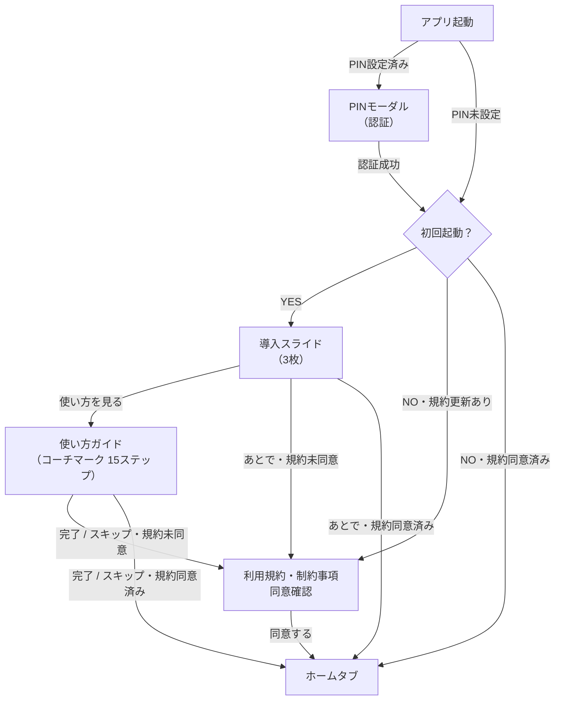

# 操作マニュアル・ヘルプ

> ソース: Morincum/docs/04_guidelines/050_user_manual.md

| 項目 | 内容 |
|------|------|
| バージョン | `v0.1.0` |
| 作成日 | 2026-03-18 |
| 対象 | アプリユーザー・QA 担当者 |

---

## 目次

1. [アプリの概要](#1-アプリの概要)
2. [初回起動](#2-初回起動)
3. [画面構成](#3-画面構成)
4. [ホームタブ](#4-ホームタブ)
5. [計画タブ](#5-計画タブ)
6. [設定タブ](#6-設定タブ)
7. [銘柄の追加・編集・削除](#7-銘柄の追加編集削除)
8. [使い方ガイド（コーチマーク）](#8-使い方ガイドコーチマーク)
9. [データ管理](#9-データ管理)
10. [FAQ](#10-faq)

---

## 1. アプリの概要

**Morincum（モリンカム）** は配当金・資産を手軽に管理するスマートフォンアプリです。
「どんぐりを集めるように、配当金を少しずつ積み上げていく」をコンセプトに、長期投資を続けるモチベーションを高めます。

### 主な機能

| 機能 | 説明 |
|------|------|
| 配当金の管理 | 保有銘柄の配当金を合計し、目標達成率を可視化 |
| 目標設定 | 「いつまでに月〇万円の配当がほしい」を計画・シミュレーション |
| NISA 管理 | NISA 成長投資枠・つみたて投資枠の残枠を管理 |
| 銘柄検索 | 日本株・米国株・投資信託（13,746 件）から銘柄を検索・登録 |
| データ管理 | CSV / JSON でデータをエクスポート・インポート |
| セキュリティ | PIN コードでアプリをロック |

---

## 2. 初回起動

### 2-1. 導入スライド

初回起動時は 3 枚のスライドでアプリの概要を紹介します。

| スライド | タイトル | 内容 |
|---------|---------|------|
| 1枚目 | 配当の森へようこそ！ | 配当金を管理して、長期投資の力を育てよう |
| 2枚目 | 市場で配当を探す。予定を貯める。 | 銘柄を登録して受け取り予定の配当金を把握 |
| 3枚目 | 長期投資で、配当を育てていく。 | 目標配当額を設定してコツコツと積み上げよう |

スライド完了後は「使い方を見る📖」から使い方ガイドを確認するか、「あとで」でホーム画面に進めます。

### 2-2. 利用規約への同意

初回起動フロー（チュートリアル / コーチマーク）が完了した後、利用規約と制約事項が表示されます。
内容を確認し「同意する」をタップしてください。

> アプリの利用規約が更新された場合は、次回起動時に再度同意を求められます。

### 2-3. 画面フロー

---

## 3. 画面構成

アプリは 3 つのタブで構成されており、**左右スワイプ**またはボトムナビゲーションで切り替えます。

| タブ | アイコン | 主な用途 |
|------|---------|---------|
| 計画 | 📈 | 目標配当額・達成期限の設定とシミュレーション |
| ホーム | 🏠 | 配当金の現状確認・銘柄一覧 |
| 設定 | ⚙️ | 口座設定・NISA 管理・データ管理 |

---

## 4. ホームタブ

ホームタブは配当金の現状を確認するメイン画面です。

### 4-1. ヘッダー

- 左側：口座名（タップで口座切替ドロワーを開く）
- 右側：設定アイコン（設定タブに移動）

### 4-2. 年間配当金カード

| 要素 | 説明 |
|------|------|
| 現状 / 目標 トグル | トグルで現状（緑）・目標（オレンジ）を切替 |
| 年間配当金額 | 現状または目標の年間配当金合計（円） |
| 目標達成率バッジ | 目標配当金に対する達成率（%） |
| 3 層進捗バー | 左から「現状配当」「株数目標達成時」「設定目標」を表示 |
| 月間カード | 現状・目標の月間配当金額を横並びで比較 |

> **現状** = 今保有している株数で得られる配当金（緑で表示）
> **目標** = 目標株数すべてを達成した場合の配当金（オレンジで表示）

### 4-3. 銘柄別配当割合カード

各銘柄が年間配当金に占める割合を円グラフで表示します。
「現状」と「目標」をトグルで切り替えて確認できます。

### 4-4. スワイプカード（横スクロール）

| カード | 内容 |
|--------|------|
| NISA 残枠カード | NISA成長投資枠・つみたて投資枠の利用額と残枠（NISA機能 ON 時のみ表示） |
| 年別推移チャート | 配当金の年別推移グラフ |

### 4-5. 銘柄リスト

| 操作 | 方法 |
|------|------|
| 銘柄の詳細・編集 | 銘柄カードをタップ |
| 銘柄の追加 | 右下の ＋ ボタン（FAB）をタップ |
| 表示切替 | ヘッダーのアイコンでカード表示 / コンパクト表示を切替 |
| ソート | ヘッダーのソートアイコンで「利回り順」「コード順」「昇順/降順」を切替 |

---

## 5. 計画タブ

### 5-1. 目標配当金額の設定

1. 「月々の目標配当金額」入力欄に金額を入力します
2. クイック選択ボタン（月 5,000 円〜月 200,000 円）から選択することもできます

### 5-2. 達成期限の設定

1. 「いつまでに達成したいか」の年を入力します
2. クイック選択ボタン（5 年後・10 年後・20 年後・30 年後）から選択できます

### 5-3. プレビュー確認

| 項目 | 内容 |
|------|------|
| あと ¥〇〇〇 | 目標達成に必要な追加の年間配当金額 |
| 達成まで ＋¥〇〇〇 | 現状と目標の差額（目標超過時はプラス表示） |

### 5-4. 保存

「保存」ボタンをタップして目標を保存します。
保存後はホームタブの進捗バーや達成率バッジに反映されます。

---

## 6. 設定タブ

### 6-1. 口座設定

| 項目 | 説明 |
|------|------|
| 口座名 | 表示する口座名を変更（最大 50 文字） |
| アイコン | 絵文字アイコンを選択（40 種類以上） |

### 6-2. 表示設定

| 項目 | 説明 |
|------|------|
| 税引後で表示 | ON にすると配当金・利回りを税引後の金額で表示 |
| 言語 | 日本語 / English を切替 |

### 6-3. NISA 設定

| 項目 | 説明 |
|------|------|
| NISA を利用する | ON にすると NISA 関連 UI を表示 |
| NISA 枠の利用額を管理する | ON にすると NISA 成長・つみたて投資枠の利用額を入力可能 |
| NISA 成長投資枠 利用額 | 今年の NISA 成長投資枠の累積投資額（上限 240 万円/年） |
| NISA つみたて投資枠 利用額 | 今年の NISA つみたて投資枠の累積投資額（上限 120 万円/年） |

### 6-4. PIN 設定

| 操作 | 手順 |
|------|------|
| PIN 設定 | 4〜6 桁の数字を入力 → 同じ数字を再入力して確認 |
| PIN 変更 | 「PIN の変更」からいつでも変更可能 |
| PIN 解除 | 「PIN を削除」でロックを無効化 |

> PIN を忘れた場合は、アプリデータを削除して再インストールする必要があります。

### 6-5. データ管理

#### SBI 証券 CSV インポート

1. 「ファイルを選択」をタップしてCSVファイルを選択
2. 既存の銘柄をどう扱うか確認ダイアログが表示されます
3. 「インポート」をタップして取り込み

#### エクスポート

| 形式 | 説明 |
|------|------|
| JSON エクスポート | 全口座・銘柄データをJSON形式で出力（バックアップ推奨） |
| CSV エクスポート | 銘柄データをCSV形式で出力 |

#### 全銘柄の削除

現在の口座のすべての銘柄データを削除します。**この操作は取り消せません。**

#### アプリの初期化

すべての銘柄・設定・PIN ロックを含む全データを削除し、初回インストール直後の状態に戻します。**この操作は取り消せません。**

> 実行前に必ず JSON エクスポートでバックアップを取ってください。

---

## 7. 銘柄の追加・編集・削除

### 7-1. 銘柄の追加

1. ホームタブで右下の ＋ ボタンをタップ
2. 証券コード・ティッカー・銘柄名で検索
3. 候補から銘柄を選択（または手動入力）
4. 各種情報を入力して「追加」をタップ

### 7-2. 入力項目

| 項目 | 説明 |
|------|------|
| 銘柄名 | 銘柄の表示名 |
| 資産種別 | 日本株 / 米国株 / 投資信託 |
| 現在値 | 現在の株価 |
| 取得単価 | 購入時の平均単価 |
| 保有数量 | NISA成長枠 / NISAつみたて枠 / 特定口座ごとの保有株数 |
| 目標数量 | NISA成長枠 / NISAつみたて枠 / 特定口座ごとの目標株数 |
| 1株あたり配当金 | 年間の1株配当金（投資信託は1万口あたり） |
| 株主優待 | 優待金額換算（段階設定あり） |
| セクター | 業種・セクター名 |
| 景気感応度 | 景気敏感株 / ディフェンシブ株 / 中立株 |

### 7-3. 銘柄の編集

1. ホームタブの銘柄カードをタップ
2. 各項目を編集して「更新」をタップ

### 7-4. 銘柄の削除

1. ホームタブの銘柄カードをタップ
2. モーダル下部の「削除」ボタンをタップ
3. 確認ダイアログで「削除」をタップ

---

## 8. 使い方ガイド（コーチマーク）

### 8-1. ガイドの開始方法

- 初回起動時：導入スライドの「使い方を見る📖」をタップ
- 2回目以降：設定タブ → 「使い方ガイドを見る」をタップ

### 8-2. ステップ一覧

| ステップ | タブ | 説明 |
|---------|------|------|
| 1 | 計画 | 目標配当金額を設定しよう |
| 2 | 計画 | 達成期限を設定しよう |
| 3 | 計画 | プレビューで確認しよう |
| 4 | 計画 | 保存を忘れずに |
| 5 | ホーム | 銘柄を登録しよう（＋ボタン） |
| 6 | ホーム | 銘柄を検索しよう |
| 7 | ホーム | 株数を入力しよう |
| 8 | ホーム | 配当金を入力しよう |
| 9 | ホーム | 株主優待を入力しよう |
| 10 | ホーム | 追加を忘れずに（追加ボタン） |
| 11 | ホーム | 年間配当金を確認しよう |
| 12 | ホーム | 銘柄別配当割合を確認しよう |
| 13 | ホーム | 銘柄リストを確認しよう |
| 14 | 設定 | NISA 設定 |
| 15 | 全体 | さぁ、はじめよう！ |

---

## 9. データ管理

### 9-1. バックアップ

1. 設定タブ → 「JSON エクスポート」→「エクスポート」をタップ
2. 共有ダイアログから保存先（クラウドストレージ等）を選択

### 9-2. 削除操作の比較

| 操作 | 削除される内容 | 保持される内容 |
|------|--------------|--------------|
| 全銘柄の削除 | 現在の口座の銘柄データのみ | 設定・PIN・口座情報 |
| アプリの初期化 | 全銘柄・設定・PIN を含む全データ | なし（初回インストール状態へ） |

---

## 10. FAQ

### Q. 銘柄が見つかりません

- 証券コード（例：8058）・ティッカー（例：AAPL）・銘柄名の一部で検索してみてください
- 検索候補に表示されない場合は、銘柄名欄に直接入力してください
- 投資信託の場合はファンドコード（例：47311263）で検索できます

### Q. 配当金の計算が合いません

- 配当金は「1株あたり年間配当金 × 保有株数」で計算されます
- 「税引後で表示」が ON の場合、税率（特定口座：20.315% / NISA：0% / 米国株：10%）が自動適用されます
- 為替レートは設定タブの「参照為替レート」を確認してください

### Q. NISA 残枠が正しく表示されません

設定タブ → NISA 設定 → 「NISA 枠の利用額を管理する」を ON にして、利用額を入力してください。

### Q. PIN を忘れました

アプリをアンインストールして再インストールしてください。**全データが削除されます。**

### Q. 複数の口座を管理したい

現バージョン（v0.1.0）では口座は 1 つです。今後のバージョンで複数口座への対応を予定しています。

### Q. データを機種変更時に引き継げますか

エクスポート機能で銘柄データを JSON/CSV で保存し、新しい端末でインポートすることで引き継げます。設定（言語・NISA 設定等）は手動で再設定が必要です。
