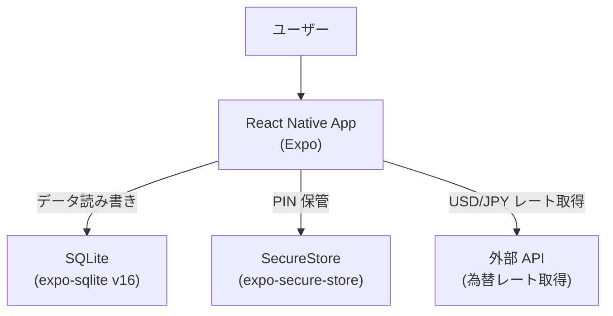
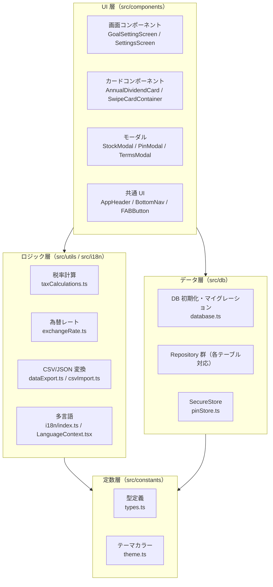
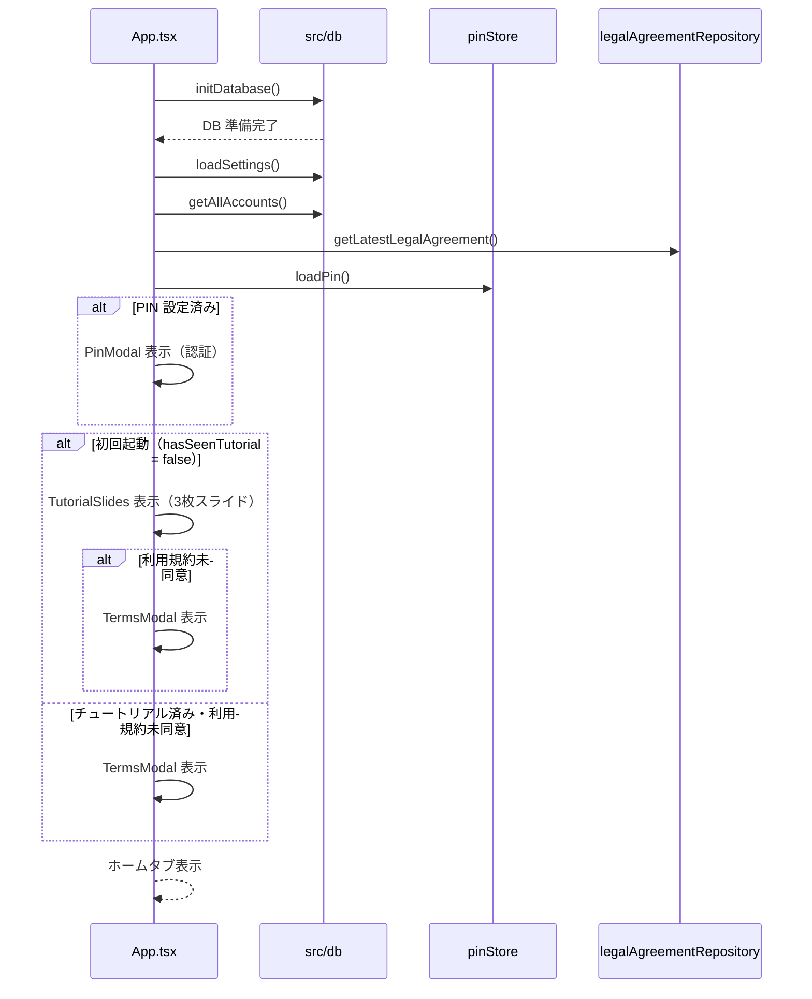

# アーキテクチャガイドライン

> ソース: Morincum/docs/03_architecture/031_architecture_guidelines.md + Morincum-backend/docs/spec/morincum-spec.md §2,§3,§11

---

## 1. システム全体構成

### 全体アーキテクチャ図

```
クライアント（iOS / Android）
  React Native + Expo
        ↓
Amazon API Gateway (HTTP API)
        ↓
AWS Lambda（TypeScript・ARM64）
  ├── RDS PostgreSQL（ユーザー・配当データ）
  ├── S3（ファイル・利用規約PDF）
  ├── Cognito（認証情報）
  └── Bedrock / Claude API（AIニュース・X投稿文生成）

【バッチ処理】
EventBridge Scheduler
        ↓ Lambda直接起動
Lambda（Python・ARM64）
  ├── yfinance / 投資信託協会API / ECB API
  │       ↓ S3（中間バッファ）
  │       ↓ POST S3キー（IAM SigV4認証）
  │       Morincum-backend Internal API
  ├── Claude API（ニュース・X投稿文生成）
  └── Slack / X API

【監視・通知】
├── CloudWatch（ログ・アラート）
├── SNS（プッシュ通知）
└── Slack Bot（状態問い合わせ・メンテナンス管理）

【CI/CD】
└── GitHub Actions（テスト・CDK deploy・Lambdaデプロイ）
```

### 4リポジトリの役割分担

| リポジトリ | 役割 | 技術スタック |
|---|---|---|
| Morincum | フロントエンド（iOS/Androidアプリ） | React Native + Expo + TypeScript |
| Morincum-backend | バックエンドAPI + インフラ（CDK） | TypeScript + Lambda + RDS PostgreSQL |
| Morincum-batch | 定期バッチ処理 | Python + Lambda + EventBridge |
| Morincum-specs | 仕様書管理 | Markdown + YAML |

---

## 2. フロントエンドアーキテクチャ

Morincum v0.1.0 は**ローカルファーストアーキテクチャ**を採用します。
すべてのデータは端末内の SQLite に保存し、外部サーバーとの通信は為替レート取得のみに限定します。



### 2-1. レイヤー構成



### 2-2. アプリ起動シーケンス



### 2-3. ナビゲーション構成

3 タブ構成（計画 / ホーム / 設定）を PanResponder + Animated.Value でスワイプナビゲーション。

| タブ | TabKey | 主なコンポーネント |
|------|--------|----------------|
| 計画 | `plan` | `GoalSettingScreen` |
| ホーム | `home` | `AnnualDividendCard`, `DividendCompositionCard`, `SwipeCardContainer`, `StockList` |
| 設定 | `settings` | `SettingsScreen` |

### 2-4. 状態管理方針

- グローバル状態は `App.tsx` の `useState` で一元管理（Redux 等は未使用）
- コンポーネントへはすべて `props` で受け渡し
- DB の変更後は必ず App.tsx でデータを再読み込みして状態を更新する

### 2-5. 依存パッケージ（主要）

| パッケージ | 用途 |
|-----------|------|
| `expo` | React Native ランタイム |
| `expo-sqlite` | ローカル DB（v16） |
| `expo-secure-store` | PIN 安全保管 |
| `expo-document-picker` | CSV ファイル選択 |
| `expo-sharing` | ファイルエクスポート共有 |
| `react-native-svg` | SVG 描画（グラフ） |

### 2-6. エラーハンドリング方針

Morincum はローカルファースト設計のため、外部 API の失敗でアプリがブロックされないことを最優先とする。ネットワーク由来のエラーは **握りつぶさず、必ずユーザーにフィードバックする**（サイレント失敗を禁止）。

#### 2-6-1. 外部 API 呼び出しの共通ルール

| 項目 | 方針 |
|---|---|
| タイムアウト | `AbortController` で 5 秒（長時間のローディングでアプリが固まるのを防ぐ） |
| 失敗時の挙動 | フォールバック値（前回値・キャッシュ・固定値）を返してアプリの起動・操作を継続 |
| ユーザー通知 | ユーザーに影響する失敗は必ずトースト通知（画面上部、自動消去 2.5 秒） |
| ログ | `__DEV__` 環境でのみ `console.warn` を許可（本番ではログ出力しない） |
| リトライ | 自動リトライはしない（操作のたびに再試行されることを想定） |

#### 2-6-2. トースト通知の種類

デザインガイドライン 16 章に準拠。フロントエンドでは以下の 4 種を使い分ける。

| 種類 | 色 | 用途 |
|---|---|---|
| 成功 (success) | `accent (#5BAD60)` | データ保存完了など |
| エラー (error) | `red (#E05C7A)` | API 接続失敗・保存失敗など |
| 警告 (warning) | `gold (#F5A623)` | NISA 枠超過など |
| 情報 (info) | `nisa1 (#4A90D9)` | 為替レート更新完了など |

#### 2-6-3. 外部 API 別のエラーハンドリング

| 呼び出し | 失敗時のフォールバック | ユーザー通知 | 備考 |
|---|---|---|---|
| `GET /guest/fx/latest`（Morincum） | Frankfurter API へフェイルオーバー | なし（フェイルオーバー成功時は UI 上で「ECB取得」バッジ表示） | 設定タブの為替カードで取得元を可視化 |
| `api.frankfurter.dev/v1/latest`（ECB） | 固定値 `FALLBACK_USD_JPY`（154.2）を使用 | `toastFxApiError` を error トーストで表示 | Morincum + Frankfurter 両方失敗時のみ |
| `GET /app/version` | バージョンチェックをスキップし起動を継続 | `toastVersionApiError` を error トーストで表示 | `VersionCheckResult.status = 'error'` を返す |
| Cognito `GetId` / `GetOpenIdToken` | `fetchGuestToken()` が `null` を返しオフライン動作 | なし（ゲスト認証はユーザーに直接見えない内部機能） | 認証不要の Frankfurter は引き続き利用可能 |

#### 2-6-4. 為替レート取得元の優先順位

```
1. Morincum バックエンド API   (source: 'morincum')    → バッジなし（通常運転）
2. Frankfurter API (ECB)       (source: 'frankfurter') → 設定タブで「ECB取得」バッジ表示
3. フォールバック固定値         (source: 'fallback')    → エラートースト + 前回値を表示
```

設定タブの「参照為替レート」セクションでは、`source` の値に応じて取得元を明示する。特に Frankfurter（欧州中央銀行の参照レート）にフォールバックした場合は「ECB取得」バッジを表示し、通常とは異なる経路でレートを取得していることをユーザーに伝える。

---

## 3. バックエンドアーキテクチャ

### 3-1. AWS環境構成

| サービス | 役割 | 設定 |
|---|---|---|
| API Gateway (HTTP API) | APIエンドポイント管理 | REST APIより約70%安 |
| Lambda (ARM64) | ビジネスロジック実行 | メモリ256MB〜512MB |
| RDS PostgreSQL | データ永続化 | db.t3.micro / シングルAZ |
| S3 | ファイル保存 | 暗号化有効・パブリックアクセス全ブロック |
| CloudWatch | ログ・監視・アラート | ログ保持期間30日 |

### 3-2. CDK スタックの依存関係

```
NetworkStack（VPC）
    ↓
DatabaseStack（RDS）
    ↓
AuthStack（Cognito）
    ↓
ApiStack（API Gateway + Lambda）← 全Stackに依存
    ↓
StorageStack / LogStack / NotificationStack
```

### 3-3. Stack一覧

| Stack | 主なリソース | Phase |
|---|---|---|
| NetworkStack | VPC・サブネット・セキュリティグループ | 1 |
| DatabaseStack | RDS PostgreSQL・Secrets Manager・SSM | 1 |
| ApiStack | API Gateway（HTTP API）・Lambda（ARM64） | 1 |
| AuthStack | Cognito UserPool・MFA・パスワードポリシー | 1 |
| StorageStack | S3バケット（アセット用・ログ用） | 2 |
| LogStack | Kinesis Firehose・EventBridge（日次集計） | 2 |
| NotificationStack | SNS・EventBridge Scheduler | 2 |

### 3-4. デプロイコマンド

```bash
# dev環境に全Stackをデプロイ
cdk deploy --all -c env=dev

# 特定のStackのみデプロイ
cdk deploy Morinkamu-Network-dev -c env=dev
cdk deploy Morinkamu-Database-dev -c env=dev
cdk deploy Morinkamu-Api-dev -c env=dev
```

### 3-5. ディレクトリ構成

```
Morincum-backend/
  ├── src/
  │     └── handlers/             # Lambda関数
  ├── infrastructure/
  │     ├── bin/app.ts            # CDKエントリーポイント
  │     └── lib/stacks/           # CDKスタック
  │           ├── network-stack.ts
  │           ├── database-stack.ts
  │           ├── api-stack.ts
  │           ├── auth-stack.ts
  │           ├── storage-stack.ts
  │           ├── log-stack.ts
  │           └── notification-stack.ts
  ├── docs/
  │     └── api/openapi.yaml      # API仕様書
  └── .github/workflows/          # CI/CD
```

---

## 4. バッチアーキテクチャ

### 4-1. 基本方針

バッチは「外部から情報を取得してバックエンドに登録する」処理が主。**送り先のバックエンドURLを環境変数で切り替えるだけで十分**なため、Lambdaのリソースは1セットで管理する。

```
Lambda（stock-price-batch）× 1本
  ├── 環境変数 BACKEND_API_URL=https://api.morincum.com      → prod向け
  ├── 環境変数 BACKEND_API_URL=https://api-stg.morincum.com  → stg向け
  └── 環境変数 BACKEND_API_URL=https://api-dev.morincum.com  → dev向け
```

### 4-2. S3中間バッファの設計

```
【直接送信の問題点】
API Gateway: 29秒タイムアウト ← 数千銘柄のデータ送信でタイムアウト発生

【S3経由の解決策】
Lambda → S3にJSONをPUT（タイムアウトなし）
       → S3キーだけをPOST（軽量・高速）
バックエンドLambda → S3からJSONを取得して処理
```

### 4-3. バッチ実行スケジュール

| バッチ名 | 実行タイミング（JST） | 概要 |
|---|---|---|
| fx-rate-batch | 平日 18:00 | 為替レート取得（ECB） |
| stock-price-batch | 平日 16:30 / 翌 6:30 | 株価OHLCV取得（yfinance） |
| dividend-batch | 平日 17:00 | 配当情報取得（yfinance） |
| fund-price-batch | 平日 19:00 | 投信基準価額取得（投資信託協会） |
| news-generate-batch | 毎週月曜 8:00 | 統計→Claude API→ニュース生成 |
| x-post-generate-batch | 毎日 9:00 | 統計→Claude API→X投稿文生成 |

---

## 5. ブランチ戦略（全リポジトリ共通）

```
feature/* → develop → staging → main
              ↓           ↓        ↓
           dev環境  staging環境  本番環境
```
