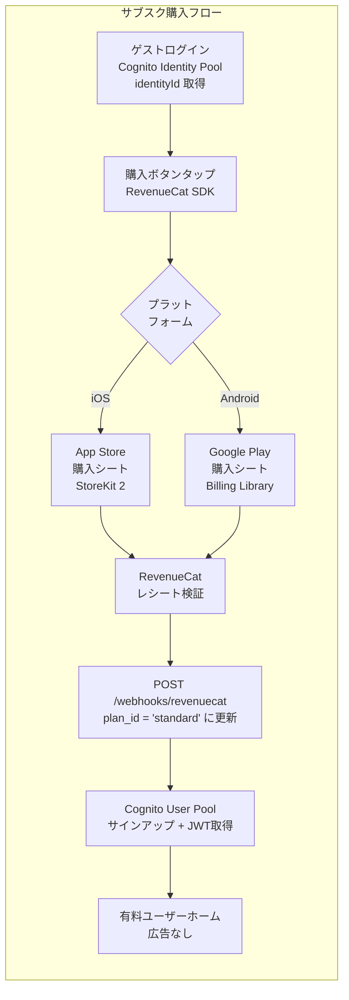
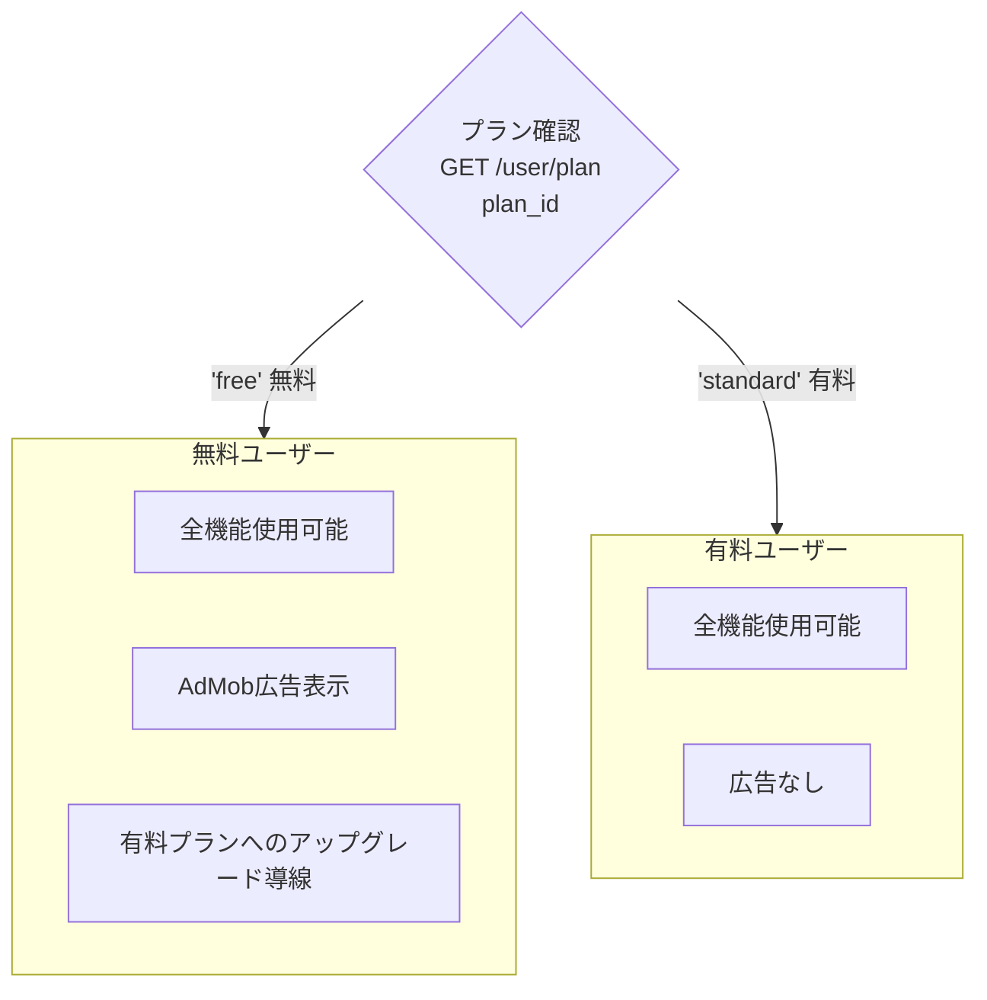

# サブスク購入フロー（課金設計）

> ソース: Morincum/docs/spec/morincum-user-flow.md（サブスク購入フロー節）

---

## 概要

### 収益モデル

| プラン | 条件 | 広告 |
|---|---|---|
| 無料ユーザー（`plan_id: 'free'`） | 全員デフォルト | AdMob広告あり |
| 有料ユーザー（`plan_id: 'standard'`） | サブスク購入後（RevenueCat） | 広告なし |

### 実装ライブラリ

**RevenueCat SDK** を使用することでiOS/Android両対応のコードが1本で書けます。  
直接実装する場合と比べて実装コストが大幅に削減されます。

---

## 購入前のユーザー識別設計

購入前のゲストユーザーは Cognito User Pool アカウントを持たず、JWTが発行されません。  
RevenueCat の `app_user_id` として **Cognito Identity Pool の `identityId`** を使用します。

```
購入前: identityId（Cognito Identity Pool）→ RevenueCat app_user_id として利用
購入後: cognitoSub（Cognito User Pool）→ RevenueCat にログイン済みユーザーとして切り替え
```

### RevenueCat Webhook のユーザー照合ロジック（3段階）

```
① appUserId を Cognito User Pool の sub（UUID）として DB 検索
      ↓ 見つかればプランを更新
② identity_id で DB 検索
      ↓ 見つかればプランを更新
③ どちらも見つからず plan_id = 'standard' の場合
      → identity_id をキーにプリレコード（購入前仮レコード）を INSERT
         （email は NULL、id は uuid_generate_v4()）
```

これにより、RevenueCat Webhook が到達した時点でまだ Cognito User Pool 登録が完了していない場合でも、プランが正しく記録されます。

---

## サブスク購入フロー図



---

## iOS / Android 比較

| 項目 | iOS | Android |
|---|---|---|
| 購入UI | App Storeの標準シート | Google Playの標準シート |
| 実装ライブラリ | StoreKit 2 | Google Play Billing Library |
| レシート検証 | RevenueCatが代行 | RevenueCatが代行 |
| 審査ガイドライン | App Store Review Guidelines | Google Play ポリシー |
| サブスク管理画面 | iOS設定アプリ | Google Playアプリ |

---

## 無料 / 有料プランの差異



| 機能 | 無料 | 有料 |
|---|---|---|
| 銘柄管理 | ✅ | ✅ |
| 配当金集計 | ✅ | ✅ |
| NISA管理 | ✅ | ✅ |
| AdMob広告 | 表示あり | **なし** |

---

## Webhook フロー（RevenueCat → バックエンド）

```
RevenueCat（購入検証完了）
    ↓ POST /webhooks/revenuecat（IAM SigV4 不要・API Key 認証）
Morincum-backend Lambda
    ↓ 3段階ユーザー照合（cognitoSub → identity_id → プリレコード作成）
    ↓ RDS users.plan_id = 'standard' に更新
クライアント（GET /user/plan で plan_id 確認）
    ↓ 有料UIに切り替え・広告非表示
```

### 関連エンドポイント

| エンドポイント | 認証方式 | 説明 |
|---|---|---|
| `GET /user/plan` | Cognito JWT Bearer | 購入済みユーザーのプラン情報取得 |
| `POST /webhooks/revenuecat` | RevenueCat API Key | RevenueCat からの購入通知受信 |

> **注意**: `GET /user/plan` はゲスト認証（SigV4）ではなく Cognito User Pool JWT 認証エンドポイントです。  
> 購入前のゲストユーザーはアクセスできないため、フロントエンドは JWT 取得失敗時は `plan_id = 'free'` をデフォルト値として使用します。

---

## 関連Issue

| Issue | 内容 |
|---|---|
| Morincum-backend #20 | RevenueCat Webhook受信エンドポイント |
| Morincum-backend #135 | V012: identity_id カラム追加・購入前ユーザー対応 |
| Morincum #221 | Cognito User Pool JWT 認証実装（cognitoAuth.ts） |
