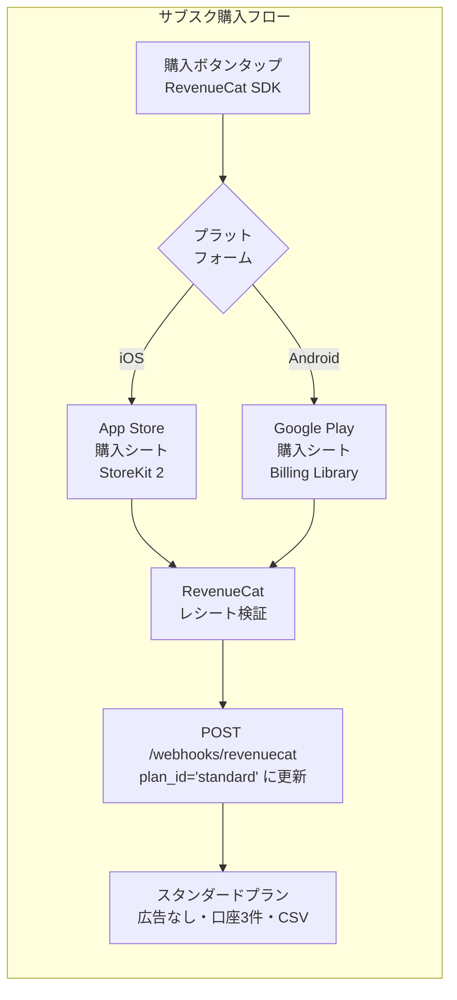
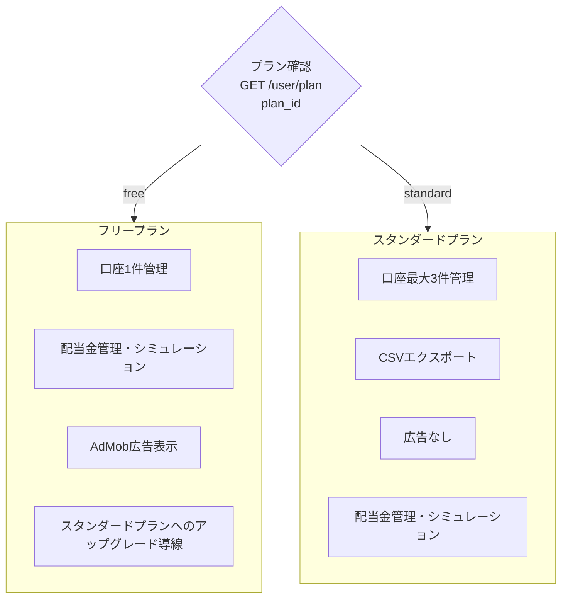

# サブスク購入フロー（課金設計）

> ソース: Morincum/docs/spec/morincum-user-flow.md（サブスク購入フロー節）

---

## 概要

### プラン一覧

| plan_id | 月額 | 口座数上限 | CSVエクスポート | 広告 |
|---|---|---|---|---|
| `free` | ¥0 | 1口座 | なし | AdMob広告あり |
| `standard` | ¥480 | 3口座 | あり | なし |

### 実装ライブラリ

**RevenueCat SDK**（`react-native-purchases`）を使用することでiOS/Android両対応のコードが1本で書けます。
直接実装する場合と比べて実装コストが大幅に削減されます。

---

## サブスク購入フロー図



---

## iOS / Android 比較

| 項目 | iOS | Android |
|---|---|---|
| 購入UI | App Storeの標準シート | Google Playの標準シート |
| 実装ライブラリ | StoreKit 2 | Google Play Billing Library |
| レシート検証 | RevenueCatが代行 | RevenueCatが代行 |
| 審査ガイドライン | App Store Review Guidelines | Google Play ポリシー |
| サブスク管理画面 | iOS設定アプリ | Google Playアプリ |

---

## フリープラン / スタンダードプランの差異



| 機能 | フリー（free） | スタンダード（standard） |
|---|---|---|
| 口座数上限 | 1口座 | **3口座** |
| 銘柄管理 | ✅ | ✅ |
| 配当金集計 | ✅ | ✅ |
| NISA管理 | ✅ | ✅ |
| CSVエクスポート | ❌ | **✅** |
| AdMob広告 | 表示あり | **なし** |

---

## Webhook フロー（RevenueCat → バックエンド）

```
RevenueCat（購入検証完了）
    ↓ POST /webhooks/revenuecat
Morincum-backend Lambda（署名検証）
    ↓ RDS users.plan_id = 'standard' に更新
クライアント（GET /user/plan で plan_id 確認）
    ↓ スタンダードプランUIに切り替え
```

### Webhook イベントマッピング

| RevenueCat イベント | バックエンド処理 |
|---|---|
| `INITIAL_PURCHASE` | `plan_id = 'standard'`、期間設定 |
| `RENEWAL` | `current_period_end` 延長 |
| `UNCANCELLATION` | `plan_id = 'standard'` |
| `CANCELLATION` | `cancelled_at` 記録 |
| `EXPIRATION` | `plan_id = 'free'` |
| `BILLING_ISSUE` | `status = 'billing_failed'` |
| `REFUND` | `plan_id = 'free'` |

### 関連エンドポイント

| エンドポイント | メソッド | 認証 | 説明 |
|---|---|---|---|
| `GET /guest/plans` | GET | 不要 | 利用可能プラン一覧取得 |
| `GET /user/plan` | GET | JWT | ユーザーの現在プラン取得 |
| `PUT /user/plan/downgrade-message-shown` | PUT | JWT | ダウングレード通知の表示済みフラグ更新 |
| `POST /webhooks/revenuecat` | POST | 署名検証 | RevenueCat からの購入通知受信 |

---

## RevenueCat appUserID の設計

フロントエンドは Cognito Identity Pool の `identity_id`（`SecureStore` の `morincum_guest_identity_id` キー）を RevenueCat の `appUserID` として使用します。

バックエンドの RevenueCat Webhook ハンドラーも `identity_id` で users テーブルを照合するため、購入前ユーザーのレコードも正しく更新されます。

---

## 関連Issue

| リポジトリ | Issue | 内容 |
|---|---|---|
| Morincum-backend | #141 | サブスクリプション申込API実装（plan.ts / revenuecat.ts） |
| Morincum | #228 | サブスクリプション申込画面の実装（PlanScreen） |
