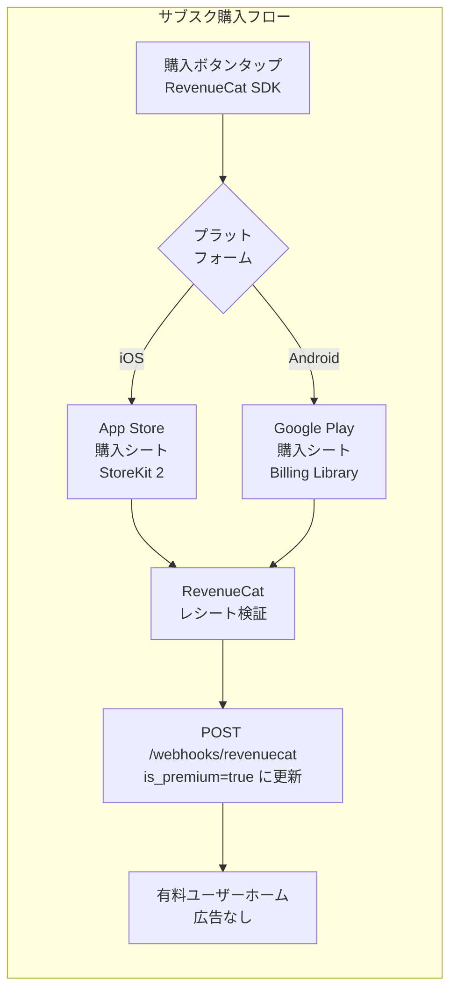

# サブスク購入フロー（課金設計）

> ソース: Morincum/docs/spec/morincum-user-flow.md（サブスク購入フロー節）

---

## 概要

### 収益モデル

| プラン | 条件 | 広告 |
|---|---|---|
| 無料ユーザー | 全員デフォルト | AdMob広告あり |
| 有料ユーザー | サブスク購入後（RevenueCat） | 広告なし |

### 実装ライブラリ

**RevenueCat SDK** を使用することでiOS/Android両対応のコードが1本で書けます。
直接実装する場合と比べて実装コストが大幅に削減されます。

---

## サブスク購入フロー図



---

## iOS / Android 比較

| 項目 | iOS | Android |
|---|---|---|
| 購入UI | App Storeの標準シート | Google Playの標準シート |
| 実装ライブラリ | StoreKit 2 | Google Play Billing Library |
| レシート検証 | RevenueCatが代行 | RevenueCatが代行 |
| 審査ガイドライン | App Store Review Guidelines | Google Play ポリシー |
| サブスク管理画面 | iOS設定アプリ | Google Playアプリ |

---

## 無料 / 有料プランの差異


| 機能 | 無料 | 有料 |
|---|---|---|
| 銘柄管理 | ✅ | ✅ |
| 配当金集計 | ✅ | ✅ |
| NISA管理 | ✅ | ✅ |
| AdMob広告 | 表示あり | **なし** |

---

## Webhook フロー（RevenueCat → バックエンド）

```
RevenueCat（購入検証完了）
    ↓ POST /webhooks/revenuecat
Morincum-backend Lambda
    ↓ RDS users.is_premium = true に更新
クライアント（GET /users/me で is_premium 確認）
    ↓ 有料UIに切り替え
```

### 関連エンドポイント

| エンドポイント | メソッド | 説明 |
|---|---|---|
| `GET /users/me` | GET | `is_premium` フラグ確認 |
| `POST /webhooks/revenuecat` | POST | RevenueCat からの購入通知受信 |

---

## 関連Issue

| Issue | 内容 |
|---|---|
| バックエンド #20 | RevenueCat Webhook受信エンドポイント |
