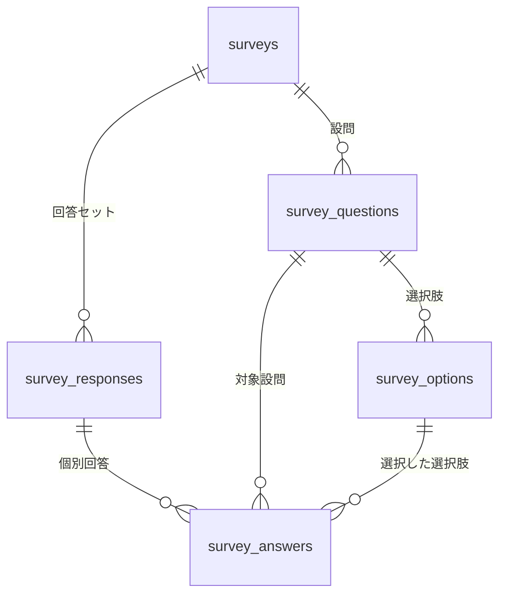

# アンケート機能仕様書

> Issue: #32  
> 作成日: 2026年5月

---

## 1. 概要

アプリ起動時にアクティブなアンケートがあればカードを表示し、ユーザーに任意回答してもらう機能。回答データはRDS（PostgreSQL）に蓄積し、集計結果をSlackに通知する。

---

## 2. 要件

| 項目 | 内容 |
|---|---|
| 表示タイミング | アプリ起動時（認証済みユーザーのみ） |
| 回答形式 | 選択式（単一・複数）・自由記述 |
| 必須 | なし（全問任意） |
| 同時アクティブ数 | 基本1件 |
| 二重回答 | 同一ユーザー（Cognito sub）は1アンケートにつき1回のみ |
| 匿名性 | 回答はDB内部でユーザーIDと紐づけるが、外部公開しない |
| 作成方法 | Internal API 経由（Claude Code から操作） |
| 集計通知 | Slack（Phase 1） |
| 管理画面 | Phase 2以降 |

---

## 3. ユーザーフロー

```
アプリ起動
  ↓
GET /surveys/active を呼び出す
  ↓
アクティブなアンケートなし → 何もしない
  ↓
アクティブなアンケートあり
  ↓
回答済み？ → 何もしない（survey_responses に記録があるか確認）
  ↓
未回答 → アンケートカードを表示
  ↓
ユーザーが任意で回答 → POST /surveys/{id}/responses
  ↓
送信完了 → カードを閉じる
（スキップも可・再表示はしない）
```

---

## 4. DB設計

### 4.1 テーブル構成

```
surveys（アンケート定義）
  └── survey_questions（設問）
        └── survey_options（選択肢）

survey_responses（回答セット：1ユーザー×1アンケート）
  └── survey_answers（個別回答：1設問×1回答）
```

### 4.2 テーブル詳細

#### surveys

| カラム | 型 | 説明 |
|---|---|---|
| id | UUID PK | |
| title | VARCHAR(255) | アンケートタイトル |
| description | TEXT | 説明文（任意） |
| status | VARCHAR(20) | `draft` / `active` / `closed` |
| starts_at | TIMESTAMPTZ | 公開開始日時（NULL = 即時） |
| ends_at | TIMESTAMPTZ | 公開終了日時（NULL = 無期限） |
| created_at | TIMESTAMPTZ | |
| updated_at | TIMESTAMPTZ | |

> `status = active` かつ `starts_at <= NOW() <= ends_at` のものを「アクティブ」とする。

#### survey_questions

| カラム | 型 | 説明 |
|---|---|---|
| id | UUID PK | |
| survey_id | UUID FK | |
| question_text | TEXT | 設問文 |
| question_type | VARCHAR(20) | `single_choice` / `multiple_choice` / `text` |
| display_order | INT | 表示順 |
| created_at | TIMESTAMPTZ | |

#### survey_options

| カラム | 型 | 説明 |
|---|---|---|
| id | UUID PK | |
| question_id | UUID FK | |
| option_text | TEXT | 選択肢テキスト |
| display_order | INT | 表示順 |

#### survey_responses

| カラム | 型 | 説明 |
|---|---|---|
| id | UUID PK | |
| survey_id | UUID FK | |
| user_id | UUID | Cognito sub（内部管理のみ） |
| submitted_at | TIMESTAMPTZ | |

> `UNIQUE(survey_id, user_id)` 制約で二重回答をDB レベルで防止。

#### survey_answers

| カラム | 型 | 説明 |
|---|---|---|
| id | UUID PK | |
| response_id | UUID FK | survey_responses.id |
| question_id | UUID FK | |
| option_id | UUID FK | 選択式の場合（nullable） |
| text_answer | TEXT | 自由記述の場合（nullable） |

### 4.3 ER図



---

## 5. API設計

### 5.1 ユーザー向け API

#### GET /surveys/active

アクティブなアンケートを取得する。回答済みの場合は `null` を返す。

**レスポンス（未回答）:**
```json
{
  "survey": {
    "id": "uuid",
    "title": "サービスに関するアンケート",
    "description": "より良いサービスのためにご回答ください。",
    "questions": [
      {
        "id": "uuid",
        "question_text": "配当の森をどのくらい使っていますか？",
        "question_type": "single_choice",
        "display_order": 1,
        "options": [
          { "id": "uuid", "option_text": "毎日", "display_order": 1 },
          { "id": "uuid", "option_text": "週に数回", "display_order": 2 },
          { "id": "uuid", "option_text": "月に数回", "display_order": 3 }
        ]
      },
      {
        "id": "uuid",
        "question_text": "改善してほしい点があれば教えてください。",
        "question_type": "text",
        "display_order": 2,
        "options": []
      }
    ]
  }
}
```

**レスポンス（回答済み or アクティブなし）:**
```json
{ "survey": null }
```

---

#### POST /surveys/{survey_id}/responses

回答を送信する。全問任意のため、未回答の設問はリクエストに含めなくてよい。

**リクエスト:**
```json
{
  "answers": [
    {
      "question_id": "uuid",
      "option_id": "uuid"
    },
    {
      "question_id": "uuid",
      "option_ids": ["uuid1", "uuid2"]
    },
    {
      "question_id": "uuid",
      "text_answer": "UIが少し分かりにくいです"
    }
  ]
}
```

**レスポンス:**
```json
{ "message": "回答を受け付けました" }
```

**エラー:**
- `409 Conflict`: すでに回答済み

---

### 5.2 Internal API（Claude Code 経由で操作）

#### POST /internal/surveys

アンケートを作成する。

```json
{
  "title": "サービスに関するアンケート",
  "description": "より良いサービスのためにご回答ください。",
  "starts_at": "2026-06-01T00:00:00Z",
  "ends_at": "2026-06-30T23:59:59Z",
  "questions": [
    {
      "question_text": "配当の森をどのくらい使っていますか？",
      "question_type": "single_choice",
      "display_order": 1,
      "options": [
        { "option_text": "毎日", "display_order": 1 },
        { "option_text": "週に数回", "display_order": 2 },
        { "option_text": "月に数回", "display_order": 3 }
      ]
    }
  ]
}
```

#### PATCH /internal/surveys/{id}

ステータスを変更する（`draft` → `active` → `closed`）。

```json
{ "status": "active" }
```

#### GET /internal/surveys/{id}/results

集計結果を取得する。

```json
{
  "survey_id": "uuid",
  "title": "サービスに関するアンケート",
  "total_responses": 42,
  "questions": [
    {
      "question_text": "配当の森をどのくらい使っていますか？",
      "question_type": "single_choice",
      "answered_count": 38,
      "options": [
        { "option_text": "毎日", "count": 15, "percentage": 39.5 },
        { "option_text": "週に数回", "count": 18, "percentage": 47.4 },
        { "option_text": "月に数回", "count": 5, "percentage": 13.1 }
      ]
    }
  ]
}
```

---

## 6. Slack通知（Phase 1）

通知先: Slack Incoming Webhook（`/morincum/slack/incoming-webhook-url`）

### 6.1 回答ごとの通知

`POST /surveys/{id}/responses` 成功時に即時通知する。

**通知例:**
```
📝 アンケート回答がありました
「サービスに関するアンケート」（3件目）

Q1. 配当の森をどのくらい使っていますか？
  → 週に数回

Q2. 改善してほしい点
  → UIが少し分かりにくいです
```

> ユーザーの特定につながる情報（user_id等）は通知に含めない。

### 6.2 クローズ時の集計通知

`PATCH /internal/surveys/{id}` で `status: closed` にしたタイミングで集計結果を通知する。

**通知例:**
```
📊 アンケート集計結果
「サービスに関するアンケート」
回答者数: 42名

Q1. 配当の森をどのくらい使っていますか？（38件回答）
  毎日: 15件 (39.5%)
  週に数回: 18件 (47.4%)
  月に数回: 5件 (13.1%)

Q2. 改善してほしい点（4件回答）
  - UIが少し分かりにくいです
  - 銘柄の検索機能がほしい
  ...
```

### 6.3 将来の変更について

回答数が増えて通知が多くなった場合は、6.1 を以下に切り替えることができる（1ヶ所の変更のみ）。

| 方式 | 内容 |
|---|---|
| 日次サマリー | 1日1回、その日の回答件数と自由記述をまとめて通知 |
| 件数マイルストーン | 10件・50件・100件などの節目で通知 |

---

## 7. 実装フェーズ

| Phase | 内容 |
|---|---|
| Phase 1 | DB migration・API実装・フロントカード表示・Slack通知（回答ごと＋クローズ時集計） |
| Phase 2 | 管理画面（アンケート作成・結果グラフ表示）・プッシュ通知 |
