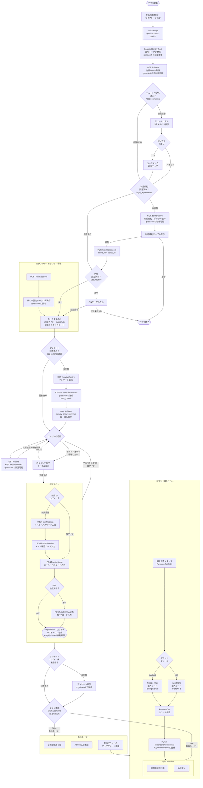

# ユーザーフロー設計

> ソース: Morincum/docs/spec/morincum-user-flow.md
> 対象：Morincum（フロントエンド）
> 更新日：2026年3月

---

## 概要

### 認証方式

| 状態 | 認証 | 利用可能なAPI |
|---|---|---|
| 未ログイン | guestAuth（Cognito匿名トークン） | stocks系・surveys・terms・notifications・fx |
| ログイン済み | cognitoAuth（Cognito JWTトークン） | 全エンドポイント |

### 収益モデル

| プラン | 条件 | 広告 |
|---|---|---|
| 無料ユーザー | 全員デフォルト | AdMob広告あり |
| 有料ユーザー | サブスク購入後（RevenueCat） | 広告なし |

### 重要な設計ポイント

- **匿名トークンはアプリ起動直後に発行する**（A案）
  - 起動直後から為替レート・株価・銘柄情報が利用可能
  - チュートリアル・利用規約取得もguestAuthで動作する
- **アンケートは未ログインでも回答可能**
  - `user_id = null` として記録
  - 回答済みフラグは `app_settings.survey_answered` にローカル保存
- **ログアウト後は新しい匿名トークンを再発行**してguestAuthに戻る

---

## フロー図


```mermaid
flowchart TD
    Start([アプリ起動]) --> InitDB[SQLite初期化・\nマイグレーション]
    InitDB --> LoadSettings[loadSettings\ngetAllAccounts\nloadPin]
    LoadSettings --> GuestToken[Cognito Identity Pool\n匿名トークン発行\nguestAuth ★起動直後]
    GuestToken --> FetchRate[GET /fx/latest\n為替レート取得\nguestAuthで即利用可能]

    FetchRate --> CheckTutorial{チュートリアル\n済み？\nhasSeenTutorial}

    CheckTutorial -->|初回起動| Tutorial[チュートリアル\n3枚スライド表示]
    Tutorial --> CheckCoach{使い方を\n見る？}
    CheckCoach -->|はい| Coach[コーチマーク\n15ステップ]
    CheckCoach -->|スキップ| CheckTerms
    Coach --> CheckTerms

    CheckTutorial -->|2回目以降| CheckTerms

    CheckTerms{利用規約\n同意済み？\nlegal_agreements} -->|未同意| FetchTerms[GET /terms/active\n利用規約・ポリシー取得\nguestAuthで取得可能]
    FetchTerms --> TermsModal[利用規約モーダル表示]
    TermsModal -->|同意| Consent[POST /terms/consent\nterms_id + policy_id]
    Consent --> CheckPin
    TermsModal -->|拒否| Exit([アプリ終了])
    CheckTerms -->|同意済み| CheckPin

    CheckPin{PIN\n設定済み？\nSecureStore} -->|あり| PinModal[PINモーダル表示]
    PinModal -->|認証成功| HomeGuest
    PinModal -->|認証失敗3回| Exit
    CheckPin -->|なし| HomeGuest

    HomeGuest[ホームタブ表示\n未ログイン・guestAuth\n全員ここからスタート] --> CheckSurveyGuest{アンケート\n回答済み？\napp_settings確認}
    CheckSurveyGuest -->|未回答| SurveyGuest[GET /surveys/active\nアンケート表示]
    SurveyGuest --> SurveyAnswerGuest[POST /surveys/id/answers\nguestAuthで送信\nuser_id=null]
    SurveyAnswerGuest --> SaveSurveyFlag[app_settings\nsurvey_answered=true\nローカル保存]
    SaveSurveyFlag --> UserAction
    CheckSurveyGuest -->|回答済み| UserAction

    UserAction{ユーザーの行動} -->|銘柄検索・株価閲覧| StocksAPI[GET /stocks\nGET /stocks/ticker/*\nguestAuthで閲覧可能]
    StocksAPI --> UserAction
    UserAction -->|ポートフォリオ\n管理したい| LoginPrompt[ログインを促す\nモーダル表示]
    UserAction -->|アカウント登録・\nログイン| AuthFlow

    LoginPrompt -->|登録する| AuthFlow
    LoginPrompt -->|あとで| UserAction

    subgraph AuthFlow[認証フロー]
        direction TB
        SignupOrLogin{新規 or\nログイン？}
        SignupOrLogin -->|新規登録| Signup[POST /auth/signup\nメール・パスワード入力]
        Signup --> Confirm[POST /auth/confirm\nメール確認コード入力]
        Confirm --> Signin
        SignupOrLogin -->|ログイン| Signin[POST /auth/signin\nメール・パスワード入力]
        Signin --> CheckMFA{MFA\n設定済み？}
        CheckMFA -->|あり| MFA[POST /auth/mfa/verify\nTOTPコード入力]
        CheckMFA -->|なし| LoginSuccess
        MFA --> LoginSuccess([cognitoAuthに切り替え\nJWTトークン取得\nAmplify SDKが自動処理])
    end

    AuthFlow --> CheckSurveyLogin{アンケート\nログイン後\n未回答？}
    CheckSurveyLogin -->|未回答| SurveyLogin[アンケート表示\ncognitoAuthで送信]
    SurveyLogin --> CheckPremium
    CheckSurveyLogin -->|回答済み| CheckPremium

    CheckPremium{プラン確認\nGET /users/me\nis_premium} -->|false\n無料ユーザー| FreeHome
    CheckPremium -->|true\n有料ユーザー| PaidHome

    subgraph FreeHome[無料ユーザー]
        direction TB
        FreeFeatures[全機能使用可能]
        FreeAd[AdMob広告表示]
        FreeUpgrade[有料プランへの\nアップグレード導線]
    end

    subgraph PaidHome[有料ユーザー]
        direction TB
        PaidFeatures[全機能使用可能]
        NoPaidAd[広告なし]
    end

    subgraph Purchase[サブスク購入フロー]
        direction TB
        PurchaseStart[購入ボタンタップ\nRevenueCat SDK]
        PurchaseStart --> StoreSheet{プラット\nフォーム}
        StoreSheet -->|iOS| AppStore[App Store\n購入シート\nStoreKit 2]
        StoreSheet -->|Android| GooglePlay[Google Play\n購入シート\nBilling Library]
        AppStore --> RevenueCat[RevenueCat\nレシート検証]
        GooglePlay --> RevenueCat
        RevenueCat --> Webhook[POST /webhooks/revenuecat\nis_premium=true に更新]
        Webhook --> PaidHome
    end

    FreeUpgrade --> Purchase

    subgraph Logout[ログアウト・セッション管理]
        direction TB
        LogoutAction[POST /auth/signout]
        LogoutAction --> NewGuestToken[新しい匿名トークン再発行\nguestAuthに戻る]
        NewGuestToken --> HomeGuest
    end
```

---

## 起動シーケンス（App.tsx）

起動時はスタートアップ画面（`StartupScreen`）を表示し、各ステップの進捗をプログレスバーとステータステキストでリアルタイム表示します。全ステップ完了後にホーム画面へ遷移します。

```
ステップ一覧（表示ラベル）:
  db      … DB・設定読み込み
  auth    … ゲスト認証
  rc      … RevenueCat初期化
  cache   … ローカルキャッシュ確認
  backend … プラン確認
  rccheck … 購入状態照合
  restore … 購入履歴復元
  sync    … 銘柄マスター同期
```

```typescript
// 実装順序（App.tsx useEffect）
1. [db] ATTパーミッション取得（iOS のみ）
        AdMob 初期化
        initDatabase() / loadSettings() / getAllAccounts()
        利用規約未同意チェック → TermsModal 表示
        PIN 設定チェック → PinModal 表示

2. [auth] clearIdentityIdIfNeeded()   // dev→prod 汚染防止
          fetchGuestCredentials()      // Cognito Identity Pool 匿名トークン

3.        checkAppVersion()            // バージョン確認（利用規約同意済み時のみ）

4. [rc]   initializeRevenueCat(identityId)  // identityId = RC appUserID

5. [cache] getSubscriptionCache()     // ローカルキャッシュ即時反映（オフライン対応）

6. [backend / rccheck / restore]      // プラン確認（fire-and-forget）
          fetchUserPlan()
            ├─ 404/null → [再インストール復元フロー]
            │     silentRestorePurchases(5000ms)
            │     → RC で standard 確認 → POST /user/plan/restore
            └─ 取得成功 → RC でダブルチェック（free の場合のみ）

7.        fetchUsdJpy()               // 為替レート取得（バックグラウンド）

8. [sync] syncSecuritiesMaster(credentials, onProgress)  // await で完了待機
          ├─ 新規インストール → 全件取得（～10,000 件、20 ページ）
          └─ 2回目以降    → updated_after による差分取得
          ※ onProgress コールバックで「(500 / 10,000件)」をリアルタイム表示

→ setDbReady(true) → ホーム画面表示
```

**重要な設計判断：**

| 項目 | 設計 | 理由 |
|---|---|---|
| 銘柄マスター同期 | `await`（完了まで待機） | fire-and-forget だと初回起動で同期されず、手動同期で1万件が必要になるため |
| プラン確認 | fire-and-forget | ホーム表示をブロックしたくない。ローカルキャッシュで先に反映 |
| RevenueCat appUserID | Cognito Identity Pool identityId | 購入前はUser Poolアカウントが存在しないため |

---

## 関連Issue

| Issue | 内容 |
|---|---|
| バックエンド #3 | Cognito認証基盤（guestAuth・cognitoAuth） |
| バックエンド #20 | RevenueCat Webhook受信エンドポイント |
| バックエンド #21 | アンケートのguestAuth対応 |
| バックエンド #149 | 再インストール後のサブスク復元（POST /user/plan/restore） |

---

## 関連ファイル

| ファイル | 説明 |
|---|---|
| `src/db/database.ts` | SQLite初期化・マイグレーション |
| `src/utils/exchangeRate.ts` | 為替レート取得（GET /fx/latest） |
| `src/utils/securitiesMasterSync.ts` | 銘柄マスター差分同期 |
| `src/utils/userPlan.ts` | プラン取得・復元（fetchUserPlan / restoreUserPlan） |
| `src/components/StartupScreen.tsx` | 起動プログレス画面 |
