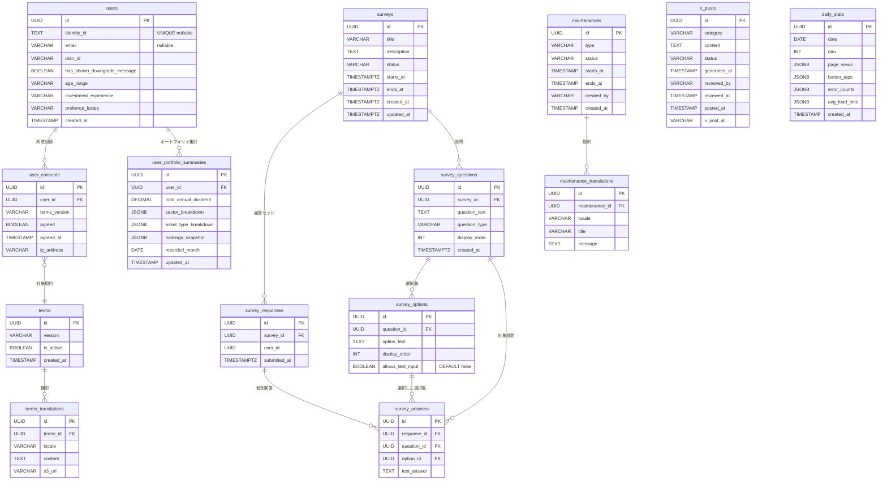

# バックエンド データベーススキーマ

> ソース: Morincum-backend/docs/spec/morincum-spec.md §4  
> データベース: PostgreSQL（RDS db.t3.micro）

---

## Phase 1 テーブル一覧

| テーブル | 説明 |
|---|---|
| users | ユーザー基本情報・プランID・identityId |
| user_consents | 利用規約の同意記録（バージョン管理） |
| terms | 利用規約定義 |
| terms_translations | 利用規約の多言語翻訳（ja/en） |
| surveys | アンケート定義（status: draft/active/closed） |
| survey_questions | 設問（single_choice/multiple_choice/text） |
| survey_options | 選択肢 |
| survey_responses | 回答セット（1ユーザー×1アンケート・UNIQUE制約で二重回答防止） |
| survey_answers | 個別回答（選択肢IDまたは自由記述テキスト） |
| user_portfolio_summaries | ユーザーごとの月次集計（配当金合計・業界割合） |
| maintenances | メンテナンス定義 |
| maintenance_translations | メンテナンス情報の多言語翻訳（ja/en） |
| announcements | 運営からのお知らせ定義 |
| announcement_translations | お知らせの多言語翻訳（ja/en） |
| x_posts | X投稿下書き管理 |
| daily_stats | アプリ行動ログの日次集計 |

## Phase 2 テーブル一覧（将来拡張）

| テーブル | 説明 |
|---|---|
| stocks | 銘柄マスタ |
| stock_dividends | 配当金履歴 |
| stock_shareholder_benefits | 株主優待定義（期ごと） |
| stock_benefit_tiers | 株数別の優待内容 |
| stock_benefit_tier_translations | 優待内容の多言語対応（ja/en） |
| stock_benefit_histories | ユーザーの優待受取履歴 |
| stock_holdings_histories | ユーザーの株数変動履歴 |

---

## ER図（Mermaid）

---

## 主要テーブル定義

### users

| カラム | 型 | NULL | 説明 |
|---|---|---|---|
| id | UUID | NOT NULL | PK。購入後は Cognito User Pool の sub。購入前は `uuid_generate_v4()` で生成 |
| identity_id | TEXT | UNIQUE, nullable | Cognito Identity Pool の identityId。購入前ユーザーの RevenueCat 連携キー |
| email | VARCHAR | nullable | メールアドレス。購入後（Cognito User Pool 登録後）にのみ設定される |
| plan_id | VARCHAR | NOT NULL | プランID: `'free'`（デフォルト）/ `'standard'` |
| has_shown_downgrade_message | BOOLEAN | NOT NULL | ダウングレード通知表示済みフラグ（デフォルト false） |
| age_range | VARCHAR | nullable | 年齢層（統計用） |
| investment_experience | VARCHAR | nullable | 投資歴 |
| preferred_locale | VARCHAR | nullable | `ja` / `en` |
| created_at | TIMESTAMP | NOT NULL | 登録日時 |

> **V012 変更点（Morincum-backend #135）**  
> - `identity_id TEXT UNIQUE` カラム追加  
> - `email` を nullable に変更（購入前のプリレコード対応）

### user_portfolio_summaries

| カラム | 型 | 説明 |
|---|---|---|
| id | UUID | PK |
| user_id | UUID | FK → users |
| total_annual_dividend | DECIMAL | 年間配当金合計（円） |
| sector_breakdown | JSONB | 業界別割合 |
| asset_type_breakdown | JSONB | 資産種別割合 |
| holdings_snapshot | JSONB | 保有銘柄スナップショット（Phase 2で活用） |
| recorded_month | DATE | 集計月（月次スナップショット） |
| updated_at | TIMESTAMP | 最終更新日時 |

### maintenances

| カラム | 型 | 説明 |
|---|---|---|
| id | UUID | PK |
| type | VARCHAR | `scheduled` / `incident` |
| status | VARCHAR | `upcoming` / `active` / `resolved` |
| starts_at | TIMESTAMP | 開始日時 |
| ends_at | TIMESTAMP | 終了日時 |
| created_by | VARCHAR | SlackのユーザーID |
| created_at | TIMESTAMP | 登録日時 |

### x_posts

| カラム | 型 | 説明 |
|---|---|---|
| id | UUID | PK |
| category | VARCHAR | `stats` / `maintenance` / `tips` |
| content | TEXT | 投稿文（140文字以内） |
| status | VARCHAR | `draft` / `approved` / `rejected` / `posted` / `skipped` |
| generated_at | TIMESTAMP | AI生成日時 |
| reviewed_by | VARCHAR | SlackユーザーID |
| reviewed_at | TIMESTAMP | 承認・却下日時 |
| posted_at | TIMESTAMP | X投稿日時 |
| x_post_id | VARCHAR | XのポストID（Phase 2で使用） |

---

## マイグレーション履歴（抜粋）

| バージョン | 内容 |
|---|---|
| V001〜V010 | 初期スキーマ構築 |
| V011 | `users.plan_id` 追加・`users.has_shown_downgrade_message` 追加（`is_premium` 廃止） |
| V012 | `users.identity_id TEXT UNIQUE` 追加・`users.email` を nullable に変更 |

---

## RDS 設定上の注意

| 項目 | 設定値 | 理由 |
|---|---|---|
| ストレージタイプ | **gp2** | gp3は無料枠対象外 |
| バックアップ期間 | **1日** | デフォルト7日だと20GBを超えて課金 |
| Multi-AZ | **無効** | 有効にすると即課金 |
| パブリックアクセス | **無効** | VPC内のみ |
