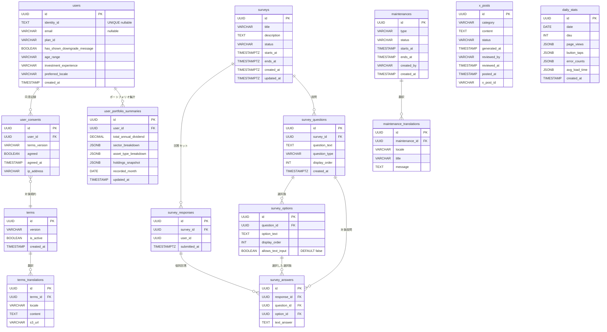

# バックエンド データベーススキーマ

> ソース: Morincum-backend/docs/spec/morincum-spec.md §4  
> データベース: PostgreSQL（RDS db.t3.micro）

---

## Phase 1 テーブル一覧

| テーブル | 説明 |
|---|---|
| users | ユーザー基本情報・プランID・identityId |
| user_consents | 利用規約の同意記録（バージョン管理） |
| terms | 利用規約定義 |
| terms_translations | 利用規約の多言語翻訳（ja/en） |
| surveys | アンケート定義（status: draft/active/closed） |
| survey_questions | 設問（single_choice/multiple_choice/text） |
| survey_options | 選択肢 |
| survey_responses | 回答セット（1ユーザー×1アンケート・UNIQUE制約で二重回答防止） |
| survey_answers | 個別回答（選択肢IDまたは自由記述テキスト） |
| user_portfolio_summaries | ユーザーごとの月次集計（配当金合計・業界割合） |
| maintenances | メンテナンス定義 |
| maintenance_translations | メンテナンス情報の多言語翻訳（ja/en） |
| announcements | 運営からのお知らせ定義 |
| announcement_translations | お知らせの多言語翻訳（ja/en） |
| x_posts | X投稿下書き管理 |
| daily_stats | アプリ行動ログの日次集計 |

## Phase 2 テーブル一覧（将来拡張）

| テーブル | 説明 |
|---|---|
| stocks | 銘柄マスタ |
| stock_dividends | 配当金履歴 |
| stock_shareholder_benefits | 株主優待定義（期ごと） |
| stock_benefit_tiers | 株数別の優待内容 |
| stock_benefit_tier_translations | 優待内容の多言語対応（ja/en） |
| stock_benefit_histories | ユーザーの優待受取履歴 |
| stock_holdings_histories | ユーザーの株数変動履歴 |

---

## ER図（Mermaid）

```mermaid
erDiagram
    users {
        UUID id PK
        TEXT identity_id "UNIQUE nullable"
        VARCHAR email "nullable"
        VARCHAR plan_id
        BOOLEAN has_shown_downgrade_message
        VARCHAR age_range
        VARCHAR investment_experience
        VARCHAR preferred_locale
        TIMESTAMP created_at
    }
    user_consents {
        UUID id PK
        UUID user_id FK
        VARCHAR terms_version
        BOOLEAN agreed
        TIMESTAMP agreed_at
        VARCHAR ip_address
    }
    terms {
        UUID id PK
        VARCHAR version
        BOOLEAN is_active
        TIMESTAMP created_at
    }
    terms_translations {
        UUID id PK
        UUID terms_id FK
        VARCHAR locale
        TEXT content
        VARCHAR s3_url
    }
    surveys {
        UUID id PK
        VARCHAR title
        TEXT description
        VARCHAR status
        TIMESTAMPTZ starts_at
        TIMESTAMPTZ ends_at
        TIMESTAMPTZ created_at
        TIMESTAMPTZ updated_at
    }
    survey_questions {
        UUID id PK
        UUID survey_id FK
        TEXT question_text
        VARCHAR question_type
        INT display_order
        TIMESTAMPTZ created_at
    }
    survey_options {
        UUID id PK
        UUID question_id FK
        TEXT option_text
        INT display_order
        BOOLEAN allows_text_input "DEFAULT false"
    }
    survey_responses {
        UUID id PK
        UUID survey_id FK
        UUID user_id
        TIMESTAMPTZ submitted_at
    }
    survey_answers {
        UUID id PK
        UUID response_id FK
        UUID question_id FK
        UUID option_id FK
        TEXT text_answer
    }
    user_portfolio_summaries {
        UUID id PK
        UUID user_id FK
        DECIMAL total_annual_dividend
        JSONB sector_breakdown
        JSONB asset_type_breakdown
        JSONB holdings_snapshot
        DATE recorded_month
        TIMESTAMP updated_at
    }
    maintenances {
        UUID id PK
        VARCHAR type
        VARCHAR status
        TIMESTAMP starts_at
        TIMESTAMP ends_at
        VARCHAR created_by
        TIMESTAMP created_at
    }
    maintenance_translations {
        UUID id PK
        UUID maintenance_id FK
        VARCHAR locale
        VARCHAR title
        TEXT message
    }
    x_posts {
        UUID id PK
        VARCHAR category
        TEXT content
        VARCHAR status
        TIMESTAMP generated_at
        VARCHAR reviewed_by
        TIMESTAMP reviewed_at
        TIMESTAMP posted_at
        VARCHAR x_post_id
    }
    daily_stats {
        UUID id PK
        DATE date
        INT dau
        JSONB page_views
        JSONB button_taps
        JSONB error_counts
        JSONB avg_load_time
        TIMESTAMP created_at
    }

    users ||--o{ user_consents : "同意記録"
    surveys ||--o{ survey_responses : "回答セット"
    survey_responses ||--o{ survey_answers : "個別回答"
    users ||--o{ user_portfolio_summaries : "ポートフォリオ集計"
    terms ||--o{ terms_translations : "翻訳"
    user_consents }o--|| terms : "対象規約"
    surveys ||--o{ survey_questions : "設問"
    survey_questions ||--o{ survey_options : "選択肢"
    survey_questions ||--o{ survey_answers : "対象設問"
    survey_options ||--o{ survey_answers : "選択した選択肢"
    maintenances ||--o{ maintenance_translations : "翻訳"
```

---

## 主要テーブル定義

### users

| カラム | 型 | NULL | 説明 |
|---|---|---|---|
| id | UUID | NOT NULL | PK。購入後は Cognito User Pool の sub。購入前は `uuid_generate_v4()` で生成 |
| identity_id | TEXT | UNIQUE, nullable | Cognito Identity Pool の identityId。購入前ユーザーの RevenueCat 連携キー |
| email | VARCHAR | nullable | メールアドレス。購入後（Cognito User Pool 登録後）にのみ設定される |
| plan_id | VARCHAR | NOT NULL | プランID: `'free'`（デフォルト）/ `'standard'` |
| has_shown_downgrade_message | BOOLEAN | NOT NULL | ダウングレード通知表示済みフラグ（デフォルト false） |
| age_range | VARCHAR | nullable | 年齢層（統計用） |
| investment_experience | VARCHAR | nullable | 投資歴 |
| preferred_locale | VARCHAR | nullable | `ja` / `en` |
| created_at | TIMESTAMP | NOT NULL | 登録日時 |

> **V012 変更点（Morincum-backend #135）**  
> - `identity_id TEXT UNIQUE` カラム追加  
> - `email` を nullable に変更（購入前のプリレコード対応）

### user_portfolio_summaries

| カラム | 型 | 説明 |
|---|---|---|
| id | UUID | PK |
| user_id | UUID | FK → users |
| total_annual_dividend | DECIMAL | 年間配当金合計（円） |
| sector_breakdown | JSONB | 業界別割合 |
| asset_type_breakdown | JSONB | 資産種別割合 |
| holdings_snapshot | JSONB | 保有銘柄スナップショット（Phase 2で活用） |
| recorded_month | DATE | 集計月（月次スナップショット） |
| updated_at | TIMESTAMP | 最終更新日時 |

### maintenances

| カラム | 型 | 説明 |
|---|---|---|
| id | UUID | PK |
| type | VARCHAR | `scheduled` / `incident` |
| status | VARCHAR | `upcoming` / `active` / `resolved` |
| starts_at | TIMESTAMP | 開始日時 |
| ends_at | TIMESTAMP | 終了日時 |
| created_by | VARCHAR | SlackのユーザーID |
| created_at | TIMESTAMP | 登録日時 |

### x_posts

| カラム | 型 | 説明 |
|---|---|---|
| id | UUID | PK |
| category | VARCHAR | `stats` / `maintenance` / `tips` |
| content | TEXT | 投稿文（140文字以内） |
| status | VARCHAR | `draft` / `approved` / `rejected` / `posted` / `skipped` |
| generated_at | TIMESTAMP | AI生成日時 |
| reviewed_by | VARCHAR | SlackユーザーID |
| reviewed_at | TIMESTAMP | 承認・却下日時 |
| posted_at | TIMESTAMP | X投稿日時 |
| x_post_id | VARCHAR | XのポストID（Phase 2で使用） |

### stocks（Phase 2・銘柄マスタ）

`Morincum-batch` の `stock_master` バッチ（JPX上場銘柄一覧・SEC EDGAR）が同期する銘柄マスタ。

| カラム | 型 | NULL | 説明 |
|---|---|---|---|
| id | UUID | NOT NULL | PK |
| ticker | VARCHAR(20) | NOT NULL, UNIQUE | 証券コード（日本株）/ ティッカー（米国株） |
| name_ja | VARCHAR(255) | nullable | 銘柄名（日本語）。米国株は翻訳バッチが埋めるまでnullの場合あり |
| name_en | VARCHAR(255) | nullable | 銘柄名（英語） |
| asset_type | VARCHAR(50) | NOT NULL | 資産種別（例: `US_STOCK`） |
| country | VARCHAR(10) | NOT NULL | `JP` / `US` |
| market | VARCHAR(50) | nullable | 市場区分。**JP: `prime`/`standard`/`growth`/`etf`/`pro`（小文字）、US: `nyse`/`nasdaq`（小文字）** |
| sector | VARCHAR(100) | nullable | 業種分類。JPはTOPIX33業種、USはGICS風12分類（下記参照）。分類未済の銘柄はnull |
| currency | VARCHAR(10) | NOT NULL | `JPY` / `USD`（デフォルト `JPY`） |
| nisa_growth_start | DATE | nullable | NISA成長投資枠の対象開始日 |
| nisa_tsumitate | BOOLEAN | NOT NULL | つみたて投資枠対象フラグ（デフォルト false） |
| updated_at | TIMESTAMP WITH TIME ZONE | NOT NULL | 最終更新日時 |

> ⚠️ **`market`は完全一致（大文字小文字を区別）でフィルタされる**（`GET /guest/stocks?market=...`）。書き込み・問い合わせのどちらも必ず小文字で統一すること。過去に米国株側だけ大文字（`NYSE`/`NASDAQ`）で問い合わせており、常に0件になるバグがあった（[Morincum-specs#48](https://github.com/satouhiroyuki/Morincum-specs/issues/48) で修正）。

**`sector`の実際の値（2026-08-11時点、dev環境で確認）:**

| 市場 | 値の例 |
|---|---|
| US（GICS風12分類） | `communication_services` / `consumer_discretionary` / `consumer_staples` / `energy` / `financials` / `healthcare` / `industrials` / `materials` / `other` / `real_estate` / `technology` / `utilities` |
| JP（TOPIX33業種） | `stock_master/handler.py` の `_JPX_SECTOR_MAP` 参照（例: `banks`, `pharmaceutical`, `electric_power_gas` など） |

### sectors（Phase 2・セクターマスタ）

セクターの多言語ラベル定義（`market` + `sector_en` の組でユニーク）。

| カラム | 型 | NULL | 説明 |
|---|---|---|---|
| id | UUID | NOT NULL | PK |
| market | VARCHAR(10) | NOT NULL | `JP` / `US` |
| sector_en | VARCHAR(100) | NOT NULL | セクターキー（英語・スネークケース） |
| sector_ja | VARCHAR(100) | NOT NULL | セクター名（日本語表示用） |

---

## マイグレーション履歴（抜粋）

| バージョン | 内容 |
|---|---|
| V001〜V010 | 初期スキーマ構築 |
| V011 | `users.plan_id` 追加・`users.has_shown_downgrade_message` 追加（`is_premium` 廃止） |
| V012 | `users.identity_id TEXT UNIQUE` 追加・`users.email` を nullable に変更 |

---

## RDS 設定上の注意

| 項目 | 設定値 | 理由 |
|---|---|---|
| ストレージタイプ | **gp2** | gp3は無料枠対象外 |
| バックアップ期間 | **1日** | デフォルト7日だと20GBを超えて課金 |
| Multi-AZ | **無効** | 有効にすると即課金 |
| パブリックアクセス | **無効** | VPC内のみ |
