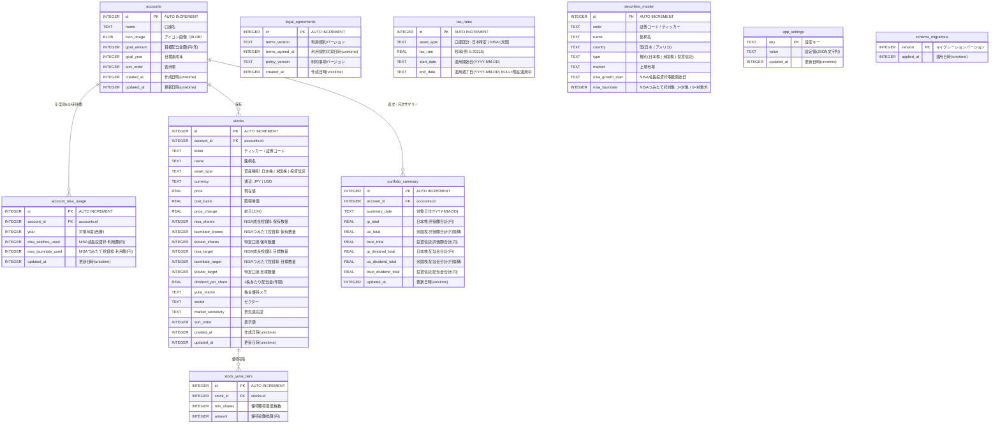

# フロントエンド データベーススキーマ

> ソース: Morincum/docs/03_architecture/030_database_schema.md
> データベース: SQLite（expo-sqlite v16）+ SecureStore（PIN）

---

## 概要

Morincum は端末ローカルに **SQLite**（expo-sqlite v16）を使用してデータを永続化します。
PIN コードのみ **SecureStore**（OS の安全なキーチェーン）に格納します。

---

## ER 図



---

## テーブル詳細

### `accounts` — 口座

| カラム名 | 型 | NULL | デフォルト | 説明 |
|---|---|---|---|---|
| `id` | INTEGER | NOT NULL | AUTO | 口座ID（主キー） |
| `name` | TEXT | NOT NULL | — | 口座表示名（最大50文字） |
| `icon_image` | BLOB | NULL許容 | NULL | アイコン画像バイト列 |
| `goal_amount` | INTEGER | NOT NULL | `0` | 目標年間配当金額（円） |
| `goal_year` | INTEGER | NOT NULL | `2030` | 目標達成年（西暦） |
| `sort_order` | INTEGER | NOT NULL | `0` | 口座一覧の表示順 |
| `created_at` | INTEGER | NOT NULL | — | 作成日時（Unixタイムスタンプ秒） |
| `updated_at` | INTEGER | NOT NULL | — | 更新日時（Unixタイムスタンプ秒） |

**制約**: 最大口座数はアプリ側で **5口座** に制限

---

### `stocks` — 銘柄

| カラム名 | 型 | NULL | デフォルト | 説明 |
|---|---|---|---|---|
| `id` | INTEGER | NOT NULL | AUTO | 銘柄ID（主キー） |
| `account_id` | INTEGER | NOT NULL | — | 所属口座（FK → accounts.id） |
| `ticker` | TEXT | NOT NULL | — | ティッカー / 証券コード |
| `name` | TEXT | NOT NULL | — | 銘柄名 |
| `asset_type` | TEXT | NOT NULL | — | `"日本株"` / `"米国株"` / `"投資信託"` |
| `currency` | TEXT | NOT NULL | `'JPY'` | `"JPY"` / `"USD"` |
| `price` | REAL | NOT NULL | `0` | 現在の株価 |
| `cost_basis` | REAL | NOT NULL | `0` | 取得単価 |
| `nisa_shares` | INTEGER | NOT NULL | `0` | NISA成長投資枠 保有数量 |
| `tsumitate_shares` | INTEGER | NOT NULL | `0` | NISAつみたて投資枠 保有数量 |
| `tokutei_shares` | INTEGER | NOT NULL | `0` | 特定口座 保有数量 |
| `nisa_target` | INTEGER | NOT NULL | `0` | NISA成長投資枠 目標数量 |
| `tsumitate_target` | INTEGER | NOT NULL | `0` | NISAつみたて投資枠 目標数量 |
| `tokutei_target` | INTEGER | NOT NULL | `0` | 特定口座 目標数量 |
| `dividend_per_share` | REAL | NOT NULL | `0` | 1株（1万口）あたり年間配当金 |
| `market_sensitivity` | TEXT | NOT NULL | `'中立株'` | `"景気敏感株"` / `"ディフェンシブ株"` / `"中立株"` |

**外部キー**: `FOREIGN KEY (account_id) REFERENCES accounts(id) ON DELETE CASCADE`

---

### `app_settings` — アプリ設定（定義済みキー）

| キー | 値の型 | 説明 |
|---|---|---|
| `active_account_id` | `number` | 現在アクティブな口座 ID |
| `display_mode` | `"card" \| "compact"` | ダッシュボードの表示形式 |
| `sort_by` | `"dividend" \| "achievement" \| "price"` | 銘柄ソート順 |
| `currency_mode` | `"JPY" \| "USD"` | 表示通貨モード |
| `is_household` | `boolean` | 世帯合算ビューの有効状態 |
| `usd_jpy` | `number` | 参照為替レート（円/ドル） |

---

### `tax_rates` — 税率マスター（初期値）

| 口座区分 | 税率 | 説明 |
|---|---|---|
| `日本特定` | 20.315% | 特定口座（源泉徴収あり）|
| `NISA` | 0% | NISA口座（非課税） |
| `米国` | 10% | 日米租税条約による軽減税率 |

---

### `securities_master` — 銘柄情報マスター

- 初期データ: 13,746件（`docs/data/securities_master.csv`）
- アプリ初回起動時に500件ずつバッチINSERT
- 銘柄検索UIの候補表示に使用

---

## PIN コードの保管

```
SecureStore キー: morincum_pin
値: 4〜6桁の PIN コード文字列（平文）
保管場所: iOS: Keychain / Android: Keystore
```

SQLite に PIN を格納しない理由: SQLite ファイルはバックアップや root 端末からアクセスされるリスクがあるため。

---

## マイグレーション戦略

`CURRENT_SCHEMA_VERSION = 5`（`src/db/database.ts`）

| バージョン | 内容 |
|---|---|
| `1` | 初期スキーマ作成（accounts / stocks / stock_yutai_tiers / app_settings） |
| `2` | accounts に `icon_image BLOB` 追加。`account_nisa_usage`・`legal_agreements`・`portfolio_monthly_summary` を新設 |
| `3` | `portfolio_monthly_summary` を `portfolio_summary` にリネーム（`summary_date` YYYY-MM-DD形式）。`tax_rates` 新設・初期データ投入 |
| `4` | `securities_master` 新設。初回起動時に全13,746件を自動シード |

---

## NISA 枠 定数

| 定数名 | 値 | 説明 |
|---|---|---|
| `NISA_SEICHOU_MAX` | `2,400,000 円` | NISA 成長投資枠の年間上限 |
| `NISA_TSUMITATE_MAX` | `1,200,000 円` | NISA つみたて投資枠の年間上限 |
| `NISA_LIFETIME_MAX` | `18,000,000 円` | NISA 生涯投資枠上限（成長・つみたて合算） |
