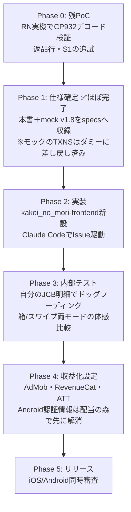

# 家計の森 by Morincum — プロダクト仕様

> ソース: kakei_no_mori-frontend/design/plan/kakeinomori-dev-plan.md（開発計画 v2.0）
> UIの正: kakei_no_mori-frontend/design/mock/kakeinomori-mock-tag-v1.jsx（mock v1.8）

| 項目 | 内容 |
|------|------|
| ステータス | `approved`（mock v1.8 を正として開発着手） |
| 更新日 | 2026-08-01 |
| アプリ名 | 家計の森 by Morincum |
| サブタイトル案 | スワイプで仕分ける、ガッチリやらない家計簿 |
| Bundle ID | `com.morincum.kakeinomori` |
| リポジトリ | `kakei_no_mori-frontend`（新規・単一リポジトリ） |
| リリース | iOS / Android 同時 |

---

## 1. プロダクト定義

Morincumブランドファミリーの3本目。**one app, one clear role**:

**「クレジットカード明細をタグの箱に仕分けて、予算との差額を投資の言葉に翻訳する」**

- 対象データはクレカ明細CSVのみ（現金・銀行・電子マネーは意図的に対象外）
- 完全オンデバイス。バックエンド・バッチ・外部連携なし（v1.0は自己完結）
- **損失表現を使わない**。予算超過すら「増やせる配当」という伸びしろで表現する
  「怒られない家計簿」がマネーフォワード等との差別化軸

---

## 2. コアコンセプト: タグ×予算モデル

- ユーザー定義タグ（**最小1〜最大7**）＋システムタグ2種（**その他**・**対象外**）
- タグごとに月予算を設定可能（任意。未設定は実績表示のみ）
- 予算差額が出口:
  - 余り = **🌱 投資入金額**（実際に投資へ回せる額）
  - 超過 = **🌿 増やせる配当**（超過分を来月予算内に収めた場合に増やせる年間配当。オレンジ=未来の色）
  - タグ間で相殺せず両方を表示。利回りは3.5%仮定と明記
- 配当の森への遷移ボタンは**v1.0では非搭載**（受信側実装後にv1.1で追加）

### システムタグの定義

| タグ | 役割 | 集計 |
|---|---|---|
| その他 | どのタグにも入らない支出の受け皿 | 支出合計に**含む**（予算対象外） |
| 対象外 | 立替・返品・経費など家計ではないもの | 支出合計から**除外** |

UI仕様（仕分けモード・画面構成）は [`../020.system/ui-spec.md`](../020.system/ui-spec.md) を参照。
データモデルは [`../030.database/frontend-schema.md`](../030.database/frontend-schema.md) を参照。
CSV取込仕様は [`../020.system/csv-import.md`](../020.system/csv-import.md) を参照。

---

## 3. 収益モデル

原則: 予算はアプリの存在理由そのものなので**Freeに含める**。

| プラン | 内容 | 収益 |
|---|---|---|
| Free | CSV取込・タグ仕分け（両モード）・タグ別予算・差額表示・当月サマリ・明細一覧 | AdMob |
| Standard | 広告なし・月次推移/年次分析・複数カード・エクスポート | サブスク（¥480/月・¥4,800/年 目安） |

### 広告

- フッター（タブバー）の**下**に常設バナー（タブバーが誤タップの緩衝になる）
- インタースティシャル不使用
- RevenueCat: Entitlement `Standard`、Webhook `https://api.morincum.com/webhooks/revenuecat` 共用（配当の森と共通基盤）

---

## 4. 開発フェーズ

Issue管理は `kakei_no_mori-frontend` リポジトリ内で完結させる（配当の森のようなフロント/バックエンド/バッチ複数リポジトリをまたぐ親子Issue運用は行わない）。

---

## 5. 残課題・リスク

| # | 項目 | 対応時期 |
|---|---|---|
| 1 | RN実機でのCP932デコードPoC | Phase 0（最優先） |
| 2 | 返品（マイナス金額）行の表記検証 | Phase 0〜3 |
| 3 | 支払区分「Ｓ１」の意味確認 | Phase 0 |
| 4 | 端末内DBの選定 | Phase 2冒頭 |
| 5 | スワイプモードのパス跨ぎUndo | v1.x で再検討 |
| 6 | タグ削除機能（割当済み明細の移動先設計が必要） | v1.x |
| 7 | 「家計の森」商標・ストア名重複確認 | Phase 2 前 |
| 8 | RevenueCat Android認証情報（配当の森側で手順確立→流用） | Phase 4 前 |
| 9 | 配当の森ディープリンク（受信側=配当の森v1.2が先行） | v1.1 |
| 10 | スピードモード（判定時間の計測から） | v1.x |
| 11 | カスタムCSVマッピングUI・他カード会社対応 | v2 |

| リスク | 対策 |
|---|---|
| CP932デコードがRNで動かない | Phase 0で最優先検証。不可ならWASM/ネイティブモジュール検討 |
| 箱ドラッグの誤ドロップ | 3点フィードバック実装済み。ドッグフーディングでヒット判定の余白を調整 |
| 「家計の森」の名前が生む全部入り期待 | ストア文言で「クレカ明細特化」を冒頭宣言 |
