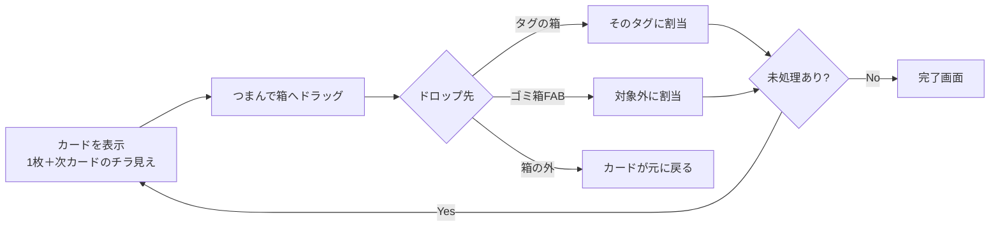

# 家計の森 UI仕様

> ソース: kakei_no_mori-frontend/design/plan/kakeinomori-dev-plan.md §3, §4, §9
> UIの正: kakei_no_mori-frontend/design/mock/kakeinomori-mock-tag-v1.jsx（mock v1.8）

---

## 1. 仕分けUI仕様

2モードをトグルで切替可能。**デフォルトは箱モード**。

### 1-1. 箱モード（デフォルト）



- 上部にタグの箱グリッド（3列。タグ＋その他で最大8箱）
  各箱: 色ドット・タグ名・件数・**予算ミニゲージ**（入れるたびに伸び、80%超オレンジ・超過赤）
- ドロップフィードバック3点セット:
  1. **カード右上バッジ**（カードに追従。行き先タグ名を色付きで表示、ゴミ箱時は「対象外 🗑」）
  2. 箱側のハイライト（拡大＋色枠）
  3. カードの**太枠4px＋同色グロー**
- ヒット判定は座標ベース（`getBoundingClientRect`）。z-indexに依存しない

### 1-2. スワイプモード（マルチパス）

- タグごとにパスを回す2択スワイプ: 右=このタグ ／ 左=ちがう（次パスへ）
- パス順=予算タブのタグ並び順。最終パスまで「ちがう」の明細は「その他」へ自動割当
- リスト型4枚同時表示・スワイプで下に補充

### 1-3. 共通仕様

| 項目 | 仕様 |
|---|---|
| メモ | カードをタップ（移動量8px未満）でメモモーダル。割当と独立 |
| Undo | 左下の円形FAB（↩）。**zIndexは最前面**。直前1件を戻す。**パス跨ぎ不可**（スワイプモード） |
| 対象外 | 右下のゴミ箱FAB（🗑）。タップで先頭カードを対象外に、箱モードではドロップ先も兼ねる |
| 進捗 | 上部バー＋「残り n 件」 |
| 完了画面 | モーリス＋森が育つ演出（どんぐりは使わない=配当の森専用）＋タグ別集計＋「予算とくらべる」 |
| ドラッグ描画 | ドラッグ中カードは zIndex 30（全ヘッダより前面）。仕分けエリアは `overflow: visible` |

---

## 2. 画面構成とナビゲーション

タブ5点構成（配当の森と同じ中央ホーム型フッター）＋フッター下に広告バナー常設。

```
仕分け ｜ サマリ ｜ [🏡ホーム] ｜ 予算 ｜ 設定
```

- **タブ間は左右スワイプで移動可能**（横60px以上かつ縦の1.5倍以上で発火）
- カード上から始まるドラッグは仕分けが優先（`stopPropagation`）。モーダル表示中は無効

| 画面 | 内容 |
|---|---|
| ホーム | 未処理件数・仕分け開始・CSV取込・モーリスのオンデバイス宣言 |
| 仕分け | §1の通り |
| サマリ | タグ別ドーナツ（中央=支出合計）／予算×実績バー（タップで明細一覧へ）／**未分類・対象外カード**（件数・金額、タップで一覧）／出口2カード（投資入金額・増やせる配当） |
| 明細一覧 | サマリ配下。フィルタ（すべて/各タグ/その他/対象外/未処理）、行展開でタグチップ再割当＋メモ編集 |
| 予算 | **タグ管理の唯一の家**: 合計バー／タグ行（タップで名前・予算編集、↑↓並べ替え=箱の表示順）／＋タグ追加（最大7）／その他表示／差引ミニサマリ |
| 設定 | 契約状態（課金導線）／カード管理／仕分け設定（スピードモード=準備中）／データ管理（取込・出力・削除・初期化）／PINロック／規約類／免責＋ブランドフッター（[design-guideline.md](../010.product/design-guideline.md) §5のロゴを表示） |

---

## 3. 技術方針

| 領域 | 方針 |
|---|---|
| フロント | React Native + Expo、EASビルド（iOSローカルビルド→Transporter、AndroidはAAB） |
| バックエンド | **不要**（課金Webhookのみ配当の森と共用） |
| バッチ | **恒久的に不要** |
| ATT | 配当の森の修正パターン（`AppState === 'active'`待ち＋300msバッファ）を初期実装 |
| ストレージ | 端末内DB（SQLite等。選定はIssue化。詳細は [`../030.database/frontend-schema.md`](../030.database/frontend-schema.md)） |
| セキュリティ | PINロック（v1.0） |
