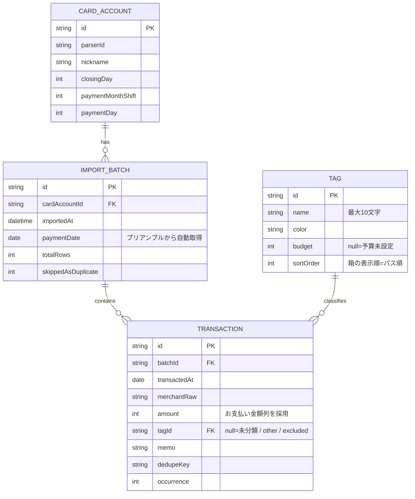

# 家計の森 フロントエンド データベーススキーマ

> ソース: kakei_no_mori-frontend/design/plan/kakeinomori-dev-plan.md §5
> データベース: 端末内ストレージ（選定はPhase 2冒頭でIssue化。候補: SQLite等）

---

## 概要

家計の森はすべてのデータを**端末内ストレージ**に保存する。バックエンドAPIは参照しない（配当の森と異なり、v1.0は完全オンデバイス）。

---

## ER図

---

## テーブル補足

### CARD_ACCOUNT

登録済みのクレジットカード。`parserId` でCSVパーサー（JCB等）を紐づける。締め日・支払シフトはCSVプリアンブルから自動取得できない場合のフォールバック値。

### IMPORT_BATCH

CSV取込1回分の単位。`paymentDate`（今回のお支払日）を軸に、家計の森の「月」の帰属を決定する（詳細は [`../020.system/csv-import.md`](../020.system/csv-import.md) §1）。

### TRANSACTION

明細1行。分類状態は `tagId` に一元化する（`null` / ユーザータグID / `other` / `excluded`）。
重複取込防止のため `dedupeKey = sha256(cardAccountId + transactedAt + merchantRaw + amount)` と、同一キー内の出現順 `occurrence` を保持する。

### TAG

ユーザー定義タグ（最小1〜最大7）。システムタグ（`other` / `excluded`）はTAGテーブルではなく `TRANSACTION.tagId` の予約値として表現する。`sortOrder` は予算画面での並び順であり、そのままスワイプモードのパス順・箱モードの表示順になる。
